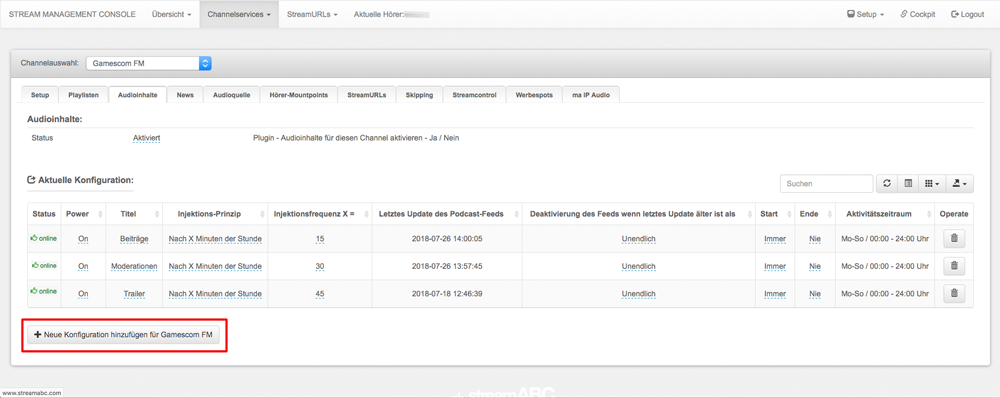

.. index:: Audioinhalte
.. index:: Dynamische Audioinhalte

Dynamische Audioinhalte
***********************

Ist es möglich, Beiträge aus einem RSS-Feed mehrfach pro Stunde im Stream laufen zu lassen?
---------------------------------------------------------------------------------

Ja. Dazu einfach eine neue Konfiguration hinzufügen.
Es ist problemlos möglich pro Podcast/RSS-Feed mehrere Konfiguartionen anzulegen.

----

Bei weiteren Fragen bitte ein Ticket öffnen: |helpdesk|

Besuchen Sie unsere Unternehmens-Website |www.streamabc.com|

.. |helpdesk| raw:: html

    <a href="https://streamabc.zammad.com" target="_blank">https://streamabc.zammad.com</a>

.. |www.streamabc.com| raw:: html

   <a href="https://www.streamabc.com/#quantum-cast" target="_blank">www.streamabc.com/#quantum-cast</a>

