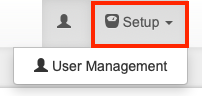

Überblick
****************

Menüpunkte 
=============

Mit der Console ist es möglich, selbständig und individuell, Komponenten und Prozesse in der QuantumCast-Plattform anzufordern und zu konfigurieren. Alle Aktivitäten werden unmittelbar und vollautomatisch umgesetzt. 

.. image:: img/Komponenten_Console.png

**QuantumCast-Console**

Hier findet man einen Überblick über die Hörerspitzen der vergangenen Monate.

**Übersicht**

Unter „Übersicht“ befinden sich die Menüpunkte „Playouts“, „Sources“, „Transcodings“, „Listenermounts“, „ma IP Audio“ und „Top-Hörerspitzen“. Es werden hier vorwiegend technische Daten angezeigt bzw. können bearbeitet werden.
 
**Channelservices**

Hier können Channel neu angelegt bzw. bestehende Channel bearbeitet werden.

**StreamURLs**

In diesem Bereich können SteamURLs generiert und bearbeitet werden. Darüber hinaus gibt es unter dem Menüpunkt „StreamURL-Domain bearbeiten“ erweiterte Einstellungen - hier kann man beispielsweise einen Primärchannel konfigurieren, der im Notfall einspringt, wenn eine fehlerhafte streamURL übermittelt wurde. Auch lassen sich hier Prerollspots unterdrücken, sollten die bei bestimmten Aggregatoren nicht erwünscht sein.

**Aktuelle Hörer**

Hier wird die Gesamthörerzahl auf allen Channel angezeigt.

**Streamwatch**

Öffnet QuantumCast Streamwatch in einem separaten Browser-Fenster. Dort haben Sie die Möglichkeit die Reichweitenauswertung anzusehen.

**Support & Helpdesk**

Ein Ticket im Helpdesk eröffnen oder in der Dokumentation, unserer Website oder bei YouTube selbst nach Lösungen suchen - wann immer Sie mit uns in Kontakt treten wollen, finden Sie hier Hilfe.

**Logout**

Hier kann man die QuantumCast-Plattform wieder verlassen.

.. index:: Symbole / Icons

----

Symbole / Icons
=================

Einige Icons auf der QuantumCast-Plattform tauchen unter verschiedenen Menüpunkten, aber mit der gleichen Funktionalität immer wieder auf. Hier ein Überblick:

.. image :: img/Tabelle_ausklappen.png

Tabelle ausklappen:
Hier kann man einstellen, ob die Tabelle auf einer oder auf mehreren Seiten angezeigt werden soll.

.. image :: img/Spalten_hinzufuegen.png

Spalten ein- und ausblenden: 
Ein Klick auf das Symbol öffnet ein Auswahlmenü, bei dem man benötigte Spalten anwählen und nicht benötigte ausblenden kann.

.. image :: img/Exportieren.png

Tabellen exportieren:
Hier hat man die Möglichkeit, Tabellen in verschiedene Formate zu exportieren.

.. image :: img/Umschalten.png

Umschalten:
Hier kann man zwischen Tabellen- und Listenansicht wechseln.

.. image :: img/Neu_laden.png

Neu Laden

.. image :: img/Loeschen.png

Löschen oder Zurücksetzen (z.B. bei Such-Filtern)

.. image :: img/Bestaetigen.png

Eingabe bestätigen

.. image :: img/Beenden.png

Eingabe abbrechen

.. image :: img/Hineinhoeren.png

Titel abspielen

----

User Management 
==================

In der QuantumCast Console können verschiedenen Usern verschiedene Rechte zugewiesen werden. Wer befugt ist das „User Management“ zu übernehmen, kann weitere Nutzer-Accounts anlegen.

Dafür in der Console unter „Setup“ auf „User Management“ klicken. Für Nutzer, die dieses Recht nicht haben, ist diese Funktion nicht sichtbar.  

Im Bereich „User Management“ findet man eine Liste mit allen Nutzern, die für diese Console freigeschaltet sind. Weiterhin wird in der Tabelle angezeigt, wann sich der User das letzte Mal eingeloggt hat, auf welche Werkzeuge er Zugriff hat und wie sein Status ist.

Um einen neuen Account zu erstellen, klickt man einfach auf „+ Neuer User“. 

Nun vergibt man in der Eingabemaske einen Usernamen (Login) und ein Passwort. Das Passwort muss aus acht oder mehr Zeichen bestehen und mindestens eine Zahl und einen Großbuchstaben enthalten. Anschließend auf „User erstellen“ klicken.

Dann können noch weitere Rechte („Permissions“) an den User vergeben werden. Dafür alle benötigten Funktionen anwählen und am Ende mit einem Klick auf den blauen Haken bestätigen.

**Zugriff:** 
Hier kann man auswählen, ob der Nutzer Zugriff auf „Console + Streamwatch“ oder auf „Streamwatch only“ erhält. Bei „Streamwatch only“ ist der Zugriff auf die Console nicht möglich!

**BrandID:** 
Sind in einer Console mehrere „BrandIDs“ (ProgrammmarkenIDs) vorhanden und soll nicht jeder Nutzer alle bearbeiten können, kann hier die entsprechende Auswahl getroffen werden. Bleibt das Feld leer, kann der User alle BrandIDs sehen.

**Channels:** 
Innerhalb einer BrandID kann man den Nutzern noch einzelne Channels zuweisen. Dafür in das Feld gehen und den Channel-Namen anfangen zu schreiben – wenn der korrekte Name angezeigt wird, einfach anklicken. Hier können auch mehrere Channels ausgewählt werden. Wird keine Auswahl getroffen, kann der User alle Channels sehen.

**Features:** 
Unter „Features“ können dem User weitere Rechte frei gegeben werde:

* Advanced Settings: Ein Administrator-Bereich, in dem speziell geschulte Operator zusätzliche Einstellungen vornehmen können (z.B. spezielle Opener/Closer für den Werbeblock einbinden)
* Connect your app: QuantumCast bietet eine Schnittstelle, die die Streams mit den Apps der Sender verbinden kann. Soll ein Nutzer entsprechende Einstellungen vornehmen, muss er hier dafür freigeschaltet werden.
* MetaSpreader: Hier können weitere Einstellungen zu den Metadaten gemacht werden (z.B. Metadaten an Aggregatoren senden)
* StreamControl Advanced Setting: Ebenfalls ein Administrator-Bereich für speziell geschulte Operator – hier allerdings zu den erweiterten Funktionen von StreamControl.
* User Management: Hier kann ein neuer Administrator angelegt werden, der dann selbst das „User Management“ übernimmt.

Hat man alle Einstellungen getroffen, erscheint der neue User in der Liste.

Klickt man auf das Bearbeiten-Symbol kann man das Profil des Nutzers jederzeit anpassen – oder auch mit einem Klick den User löschen oder das Profil deaktivieren.

Während ein gelöschter User aus der Liste verschwindet, wird ein Deaktivierter zwar weiter aufgeführt, kann sich aber nicht mehr mit seinen Zugangsdaten einloggen.

----

Passwort ändern 
==================

Jeder User hat in der QuantumCast Console die Möglichkeit sein eigenes Passwort zu ändern. Dafür einfach auf das Symbol klicken.

Im Profil ist der Username fix, dass Password kann allerdings verändert werden. Dafür auf das Passwort klicken, das neue Eingeben und mit einem Klick auf den blauen Haken bestätigen.

Unter „Last Sessionlogs“ kann man zusätzlich den Zeitpunkt der letzten Aktivitäten sehen.

----

.. index:: Hörerzahlen

Hörerspitzen 
===============

Die Top-Hörerzahlen der vergangenen Monate immer im Blick - mit der QuantumCast Console kann man jederzeit nachschauen, wie sich die Nutzung der eigenen Channels im Laufe der Zeit entwickelt.

Der schnellste Weg dafür: auf „QuantumCast-Console“ klicken - hier findet man die Peaks der letzten sechs Monate. Die angezeigten Daten lassen sich in verschiedenen Formaten exportieren.

.. image :: img/Gesamt_Hoererspitzen.png

Eine genauere Auswertung findet man unter „Übersicht“ und „Top-Hörerspitzen“.

.. image :: img/Top_Hoererspitzen_01.png

Hier erhält man einen Überblick über die vergangenen 24 Monate. Es ist auch möglich, sich einzelne Monate gezielt anzeigen zu lassen. Und natürlich lässt sich die Tabelle in verschiedenen Formaten exportieren.

.. image :: img/Top_Hoererspitzen_02.png

1. Volltextsuche in allen Feldern
2. Ganze Tabelle auf einer Seite anzeigen
3. Tabelle exportieren
4. Anzeige der Einträge pro Seite (10 oder 25)
5. Nächste Seiten anzeigen

Die Kosten für den Kunden richten sich nach den Hörerspitzen - abgerechnet wird immer der 2. Peak. 

----

Bei weiteren Fragen bitte ein Ticket öffnen: |helpdesk|

Besuchen Sie unsere Unternehmens-Website |www.quantumcast-digital.de|

.. |helpdesk| raw:: html

    <a href="https://streamabc.zammad.com" target="_blank">https://streamabc.zammad.com</a>

.. |www.quantumcast-digital.de| raw:: html

   <a href="https://www.quantumcast-digital.de" target="_blank">www.quantumcast-digital.de</a>

.. |Console| raw:: html

   <a href="https://www.quantumcast-digital.de" target="_blank">Console</a>
   
