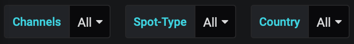
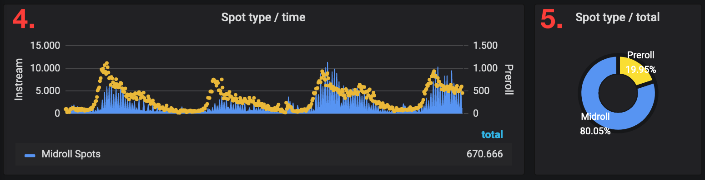
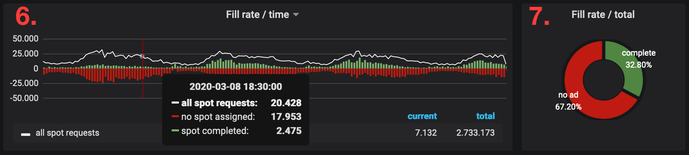
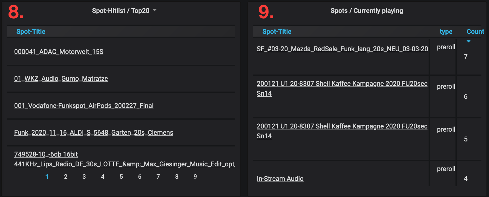
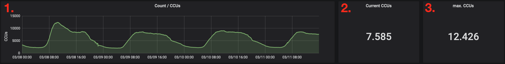
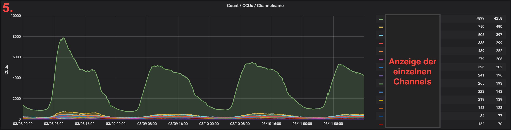
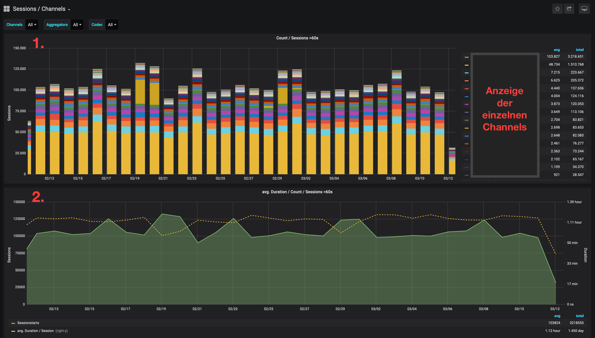

Dashboards
****************

.. index:: spots overvie

Spots Overview
==================

Nach dem Einloggen gelangt man direkt auf das Dashboard „Spots Overview“. Der Kunde erhält hier einen Überblick über seine Werbeausspielungen aus den vergangenen drei Tagen. Bei diesem Dashboard handelt es sich um eine Echtzeit-Anzeige der Daten. 

.. image:: img/Dashboard_Spots_Ueberblick.png

Wenn man in eines der Diagramme klickt und die Maustaste gedrückt hält, kann man einen Bereich auswählen. Dieser wird dann vergrößert und kann genauer betrachtet werden. Mit der Zurück-Taste des Browsers gelangt man wieder in die 3-Tage-Ansicht.

Über den Diagrammen befinden sich die Filter. Im Dashboard „Spots Overview“ kann man nach den eigenen Channels, dem Spot-Type (Pre-Roll, Mid-Roll) und den einzelnen Herkunftsländern der Nutzer selektieren.

Die Grafiken „Spots / Revenue“ zeigen die Erlöse pro Stunde.

.. image:: img/Dashboard_Spots_Revenues.png

Im 1. Diagramm lässt sich ablesen, wieviel Geld man über den Zeitraum hinweg mit Werbung verdient hat. Jeder Balken steht dabei für eine Stunde. Die Summe daneben (2.) zeigt die Erlöse in Euro über dieselbe Zeit und anschließend (3.) folgt der Vergleichswert von vor einer Woche. Die Informationen zu dieser Berechnung kommen von den Ad-Servern.
        
Da es sich hierbei um Echtzeit-Daten handelt, kann es zu minimalen zeitlichen Verzögerungen bei manchen Prozessen kommen, die dann zu 
leichten Abweichungen der Zahlen führen.

Unter „Spot type / time“ (4.) sieht man die Verteilung von Pre-Roll (gelb) und Mid-Roll-Spots (blau) über den gesamten Zeitraum. Anschließend werden beide Ad-Formen ins Verhältnis zueinander gesetzt (5.). 

Die Fill rate gibt Auskunft über das Verhältnis von angefragten und tatsächlich ausgespielten Spots. 

Im Diagramm „Fill rate / time“ (6.) zeigen die grünen Linien, die komplett gespielten und die roten, die nicht ausgelieferten Spots – auch hier über den Zeitraum von drei Tagen. Die weiße Linie markiert alle von QuantumCast angefragten Spots (all spot requests). Die Ungleichheit kommt zustande, da nicht bei jeder Anfrage auch ein Sport vom Add-Server geliefert wird. Bei „Fill rate / total“ (7.) lässt sich das Verhältnis „complete“ und „no add“ noch einmal deutlich erkennen.

Unter den Diagrammen befinden sich noch zwei Listen:

Die eine Liste (8.) zeigt die am häufigsten gespielten Spots, die andere Liste (9.) welche gerade zu hören sind. 

Unter „Spots / currently“ (10.) werden die Spots angezeigt, die gerade in diesem Augenblick auf meinen Channels ausgespielt werden. Auch hier kann es zu minimalen Abweichungen der Echtzeit-Daten kommen.

.. image:: img/Dashboard_Sports_Total_Listener.png

„Spots / Total“ (11.) ist die Anzahl der Spots, die im definierten Zeitraum komplett ausgespielt wurden. „Current Listeners“ (12.) zeigt die Anzahl der aktuellen Hörer.

Darunter befindet sich eine Karte (13.), auf der die Verbindungen der vergangenen 90 Minuten mit einem roten Punkt, bzw. bei sehr vielen Hörern mit einem Kreis gekennzeichnet sind. Für eine genauere Untersuchung kann man über den Filter bestimmte Länder auswählen.

.. image:: img/Dashboard_Spots_Geo.png

Unter der Karte sind die Top Städte (14.) und Länder (15.) aufgelistet.

----

Current Listeners
=====================

Bei diesem Dashboard handelt es sich ebenfalls um Echtzeit-Daten. Zur Ermittlung der CCU (concurrent users), also der parallelen Hörer, wird alle paar Sekunden die Anzahl der Hörer auf dem Stream gemessen. Filtern kann man in diesem Dashboard nach den einzelnen Channels.

.. image:: img/Listeners_Ueberblick.png

Im Diagramm „Count / CCUs“ (1.) werden die parallelen Hörer in den vergangenen drei Tagen angezeigt. 

Daneben wird die aktuelle Hörerzahl (2.) und der Spitzenwert des Zeitraums (3.) angegeben.

Darunter, bei „Count / CCUs / Broadcasttype“ (4.) werden die Hörer noch einmal nach der Art der Verbreitung aufgeschlüsselt. Diese Einstellung kann jeder Kunde in der QuatumCast Console vornehmen.

Dokumentation Channel bearbeiten / Broadcast-Type einstellen:
https://streamabc-documentation.readthedocs.io/de/latest/quantumcast/console/channelservices.html#den-channel-bearbeiten-oder-loschen

.. image:: img/Listeners_BroadcastType.png

Die grüne Linie zeigt die Simulcasts, die gelbe die Web-Only-Channels. Daneben werden noch maximale und aktuelle Hörer angegeben

Unter „Count / CCUs Channelname“ (5.) werden allen Channels im zeitlichen Verlauf einzeln aufgezeigt – so kann man die Erfolge der einzelnen Programme besser vergleichen. Für eine bessere Übersichtlichkeit empfiehlt es sich, die Anzahl der Channels über den Filter zu begrenzen.

Neben dem Diagramm befindet sich noch die Legende und die maximalen und aktuellen Hörerzahlen.

Zu guter Letzt werden in diesem Dashboard noch die Skip-Streams (6.) ausgewertet. Bei Kunden, die die Skip-Funktion einsetzten, werden hier alle Channels angezeigt, auf denen geskipt wird.

.. image:: img/Listeners_Skip.png

----

Sessions / Channel
=====================

Das Dashboard „Sessions / Channel“ zeigt alle Sessions der vergangenen 30 Tage. Es handelt sich hier um keine Echtzeit-Daten.

Um sich die Daten genauer anzusehen, können über die Filter die einzelnen Channels, Aggregatoren und Codecs (aacp, mp3) ausgewählt werden.
 
Im Diagramm „Count / Sessions > 60 sec“ (1.) werden die Hörer-Sessions angezeigt – jeder Balken steht dabei für einen Tag. Die unterschiedlichen Farben zeigen die einzelnen Channels. Rechts daneben befindet sich eine Legende. Hier können die durchschnittlichen (avg = average) und die totalen Werte des Zeitraums nochmal abgelesen werden.

Im unteren Diagramm „avg. Duration / Count / Sessions > 60 sec (2.) markiert die gelbe Linie die durchschnittliche Dauer einer Session. Der grüne Bereich zeigt die Summe aller Sessions.

----

Sessions / Aggregators
=========================

Im Dashboard „Sessions / Aggregators“ werden ebenfalls die Daten der vergangenen 30 Tage angezeigt. Filtern kann man hier ebenfalls nach Channels, Aggregators und Codec.

.. image:: img/SessionsAggregators_Ueberblick.png

Achtung! Die Aggregatoren können nur korrekt angezeigt werden, wenn sie zuvor gemanagt wurden. Ist dies der Fall, kann man in diesem Dashboard sehr gut erkennen, über welche Wege die Hörer kommen.

Hinweise zum Management von Aggregatoren:
https://streamabc-documentation.readthedocs.io/de/latest/quantumcast/faq/streamurls.html#wie-ist-es-moglich-mit-der-streamurl-die-jeweiligen-reichweiten-von-homepage-apps-und-aggreagtoren-zu-messen

Das erste Diagramm „Aggregators / Count / Sessions > 60 sec” zeigt die Hörer-Sessions – die unterschiedlichen Farben stehen dabei für die verschiedenen Aggregatoren. Jeder Balken steht für einen Tag. Darunter befindet sich die Legende.

Unter “Aggregators / avg. Duration / Sessions > 60 sec“ (2.) lässt sich die durchschnittliche Dauer der Session sortiert nach Aggregatoren ablesen. Auch hierzu gibt es eine Legende, in der die maximale und die durchschnittliche Hördauer (Duration) angezeigt werden.

----

Sessions / User Agents
=========================

Ein User Agent ist die Kennung, mit der sich ein Programm bei einem Webserver anmeldet. Verschiedene Geräte (Computer, Smartphones, Sprachassistenten etc.) haben dabei verschiedene Kennungen. Diese sind vom Hersteller vorgegeben und können nicht verändert werden. Aus diesem Grund ist dieser Bereich schwer managebar. 

Das Dashboard „Sessions / User Agents“ zeigt die Daten aus den vergangenen 30 Tagen. Auch hier können die Filter Channels, Aggregators und Codec eingestellt werden.

.. image:: img/SessionsUserAgents_Ueberblick.png

Die obere Grafik „Agents / Count / Sessions > 60 sec” (1.) zeigt die Hörer-Sessions aufgeschlüsselt nach den einzelnen User Agents. Unter dem Diagramm werden die Top 20 angezeigt.

Bei „Agents / avg. Duration / Sessions > 60 sec“ (2.) wird die durchschnittliche Dauer der Session bezogen auf die User Agents dargestellt.

----

Bei weiteren Fragen bitte ein Ticket öffnen: |helpdesk|

Besuchen Sie unsere Unternehmens-Website |www.quantumcast-digital.de|

.. |helpdesk| raw:: html

    <a href="https://streamabc.zammad.com" target="_blank">https://streamabc.zammad.com</a>

.. |www.quantumcast-digital.de| raw:: html

   <a href="https://www.quantumcast-digital.de" target="_blank">www.quantumcast-digital.de</a>

.. |Console| raw:: html

   <a href="https://www.quantumcast-digital.de" target="_blank">Console</a>
   
