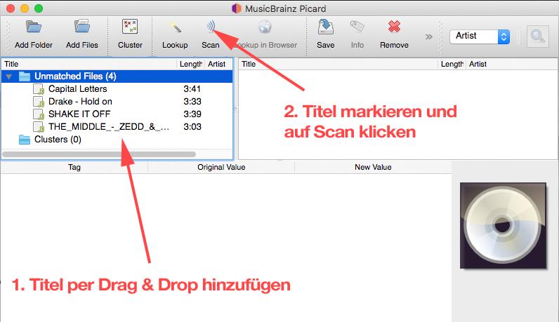
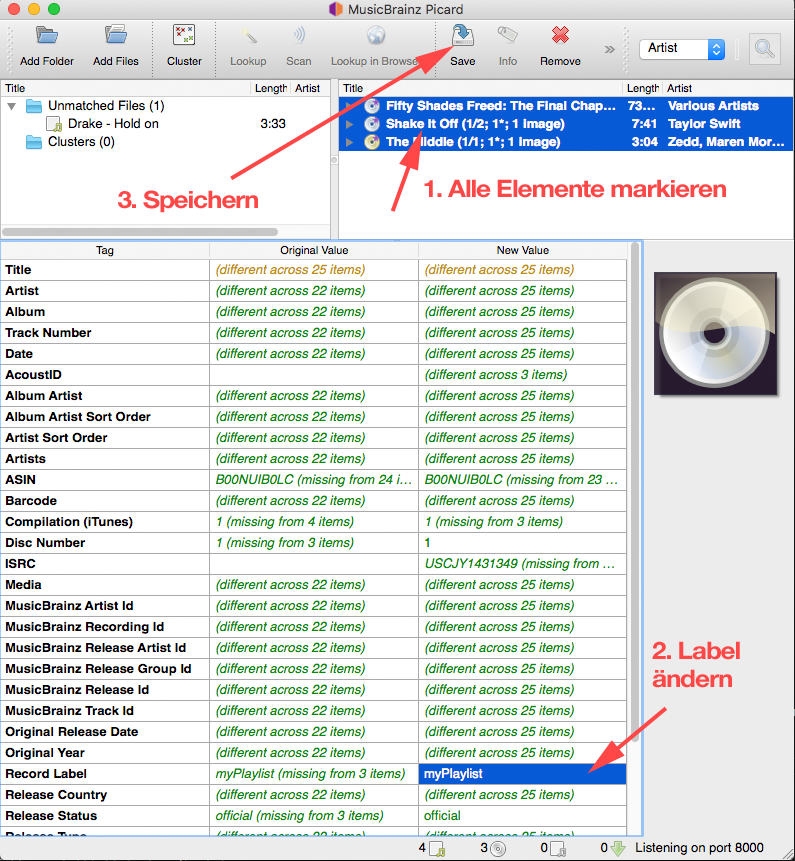
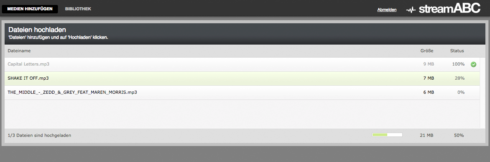
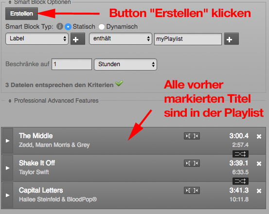
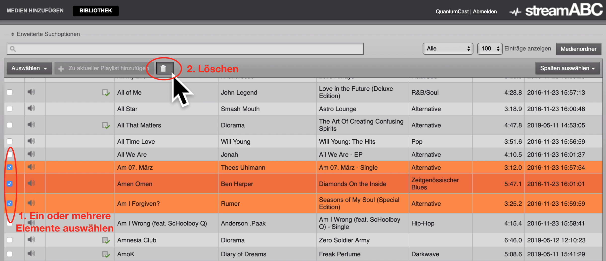
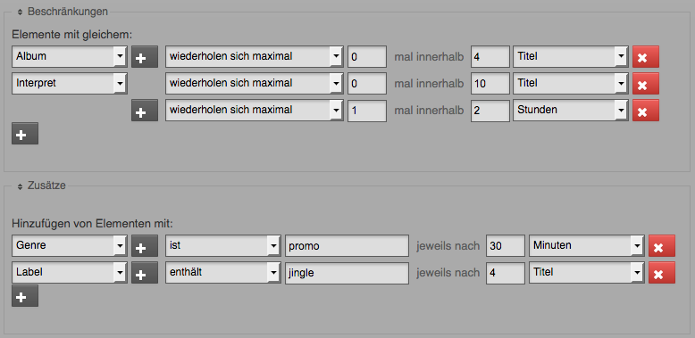
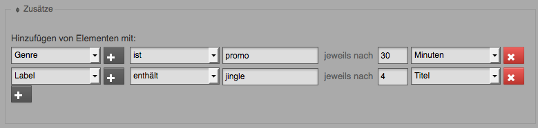
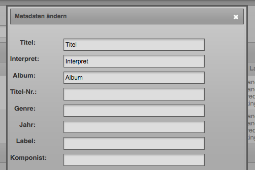
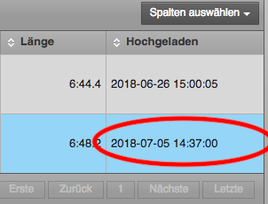

.. index:: PlaylistDesigner

PlaylistDesigner
****************

----

.. index:: Playlist erstellen
.. index:: Schnellster Weg zur Playlist

Wie erstelle ich am schnellsten einen Stream aus vorhandenen MP3-Dateien?
-------------------------------------------------------------------------

Voraussetzung:
Eine Auswahl an MP3-Dateien, einen Zugang zum PlaylistDesigner und ein Internetbrowser.

Drei Schritte:
    1. Metadaten der MP3-Dateien aktualisieren und die Titel für die Playlist markieren
    #. Upload der Dateien im PlaylistDesigner
    #. Neuen Smartblock für Playlist anlegen und markierte Titel der Playlist zuweisen

Im Folgenden jetzt die detaillierte Beschreibung der drei Schritte:

.. index:: ID3-Tag
.. index:: ID3-Tag-Editoren
.. index:: MP3-Dateien taggen
.. index:: Titel für die Playlist markieren

Metadaten der MP3-Dateien aktualisieren und die Titel für die Playlist markieren
~~~~~~~~~~~~~~~~~~~~~~~~~~~~~~~~~~~~~~~~~~~~~~~~~~~~~~~~~~~~~~~~~~~~~~~~~~~~~~~~
Um später, beim Abspielen der Playlist, Titel und Artist korrekt anzeigen zu können,
dafür müssen korrekte Metadaten in den MP3-Dateien vorhanden sein. 
Realisiert wird das über den ID3-Tag.

.. seealso:: `ID3-Tag - Wikipedia <https://de.wikipedia.org/wiki/ID3-Tag>`_

Um den ID3-Tag in den MP3-Dateien zu verändern, benötigt man ein kleines Zusatzprogramm.
Es gibt im Internet ein große Auswahl an ID3-Tag-Editoren. Wir bevorzugen "MusicBrainz Picard", 
weil er automatisch die Titel erkennt 
und mittels Internetdatenbanken viel Informationen per Mausklick anreichert.
Im Internet finden Sie "MusicBrainz Picard" unter:
`https://picard.musicbrainz.org/ <https://picard.musicbrainz.org/>`_

Prinzipiell aber ist der ID3-Tag auch wichtig, um MP3-Dateien für Playlisten zu markieren. 
Im PlaylistDesigner kann man Titel einer Playlist automatisch zuordnen lassen, wenn sie einem Kriterium entsprechen, z.B. einem bestimmten Label.
Ziel in diesem Beispiel ist es, das Label vorab einheitlich für alle MP3-Dateien zu benennen, um dann im PlaylistDesigner über das Label-Kriterium die Playlist generieren zu lassen.
Das ist der schnellste Weg eine Playlist aus vorhandenen MP3-Dateien zu erstellen.

.. index:: MP3-Dateien Upload

Upload der Dateien im PlaylistDesigner
~~~~~~~~~~~~~~~~~~~~~~~~~~~~~~~~~~~~~~
Um Ihrer Bibliothek weitere Audio-Elemente hinzuzufügen, klicken Sie auf „Medien hinzufügen“. Dann können Sie die Dateien hochladen.

.. index:: Smartblock erstellen
.. index:: Titel für Smartblock auswählen
.. index:: Playlist erstellen

Neuen Smartblock für Playlist anlegen und markierte Titel der Playlist zuweisen
~~~~~~~~~~~~~~~~~~~~~~~~~~~~~~~~~~~~~~~~~~~~~~~~~~~~~~~~~~~~~~~~~~~~~~~~~~~~~~~
.. image:: img/schnellste-playlist/04-schnellste-playlist.png
Auf den Button "Medienordner" klicken

.. image:: img/schnellste-playlist/06-schnellste-playlist.png
Dann auf "Neu" und "Neuer Smartblock" klicken

.. image:: img/schnellste-playlist/07-schnellste-playlist.png
"Kriterien" und "Attribut" ändern und auf den Button "Erstellen" klicken.

Die Playlist aus vorhandenen MP3-Dateien ist fertig. 
Der Audiostream kann anschließend mit einem Klick in der Console aktiviert werden.

.. seealso:: `QuantumCast-Console <https://www.streamabc.com/de/quantumcast-console>`_

----

.. index:: Beschränkungen
.. index:: Zusätze
.. index:: Wiederholungen verhindern

.. index:: Dateien löschen

Wie lösche ich Dateien im PlaylisteDesigner?
--------------------------------------------

Eine oder mehrere Dateien löschen:

1. Wählen Sie in der Bibliothek ein oder mehrere Elemente aus
#. Klicken Sie auf den Lösch-Button und bestätigen Sie den Vorgang

Viele Dateien auf einmal löschen:

1. Gehen Sie in "Erweiterte Suchoptionen" und grenzen Sie die angezeigten Ergebnisse entsprechend Ihrer Lösch-Wünsche ein
#. Bei "Auswählen" die ganze Seite anwählen, um möglichst viele Dateien auf einmal zu markieren
#. Löschen
#. Wollen sie nicht alle markierten Datein löschen, ist es möglich einzelne Elemente abzuwählen - dazu einfach das Häkchen entfernen

.. image:: img/viele-dateien-loeschen.png

.. seealso:: `Video-Tutorial "Elemente im PlaylistDesigner löschen" <https://youtu.be/z1b2acVCrwc>`_
----

Beschränkungen und Zusätze
--------------------------

Es ist möglich zusätzliche Regeln zu definieren, um die Playlist eines Streams weiter im Detail zu individualisieren.
Innerhalb der Konfiguration eines Smartblocks können Sie Beschränkungen und Zusätze definieren.

Mit Hilfe von Beschränkungen regeln Sie, wie oft z.B. der gleiche Interpret oder Songs aus dem gleichen Album im Stream zu hören sein dürfen. 
Sie können damit sehr einfach Wiederholungen verhindern.

Im Bereich "Zusätze" können Sie sehr genau einstellen, in welcher Regelmäßigkeit z.B. Jingles oder Promos im Stream laufen sollen.
Aber auch das regelmäßige Spielen eines zufälligen Songs aus einem Album lässt sich mit dieser Funktion umsetzen.

----

.. index:: Promos
.. index:: Jingles
.. index:: Teaser

Promos, Jingles und Teaser-Elemente
-----------------------------------

.. index:: Zusatz-Elemente systematisch einem Stream hinzuzufügen

Welche Möglichkeiten gibt es, um Zusatz-Elemente wie z.B. Jingles systematisch einem Stream hinzuzufügen?
~~~~~~~~~~~~~~~~~~~~~~~~~~~~~~~~~~~~~~~~~~~~~~~~~~~~~~~~~~~~~~~~~~~~~~~~~~~~~~~~~~~~~~~~~~~~~~~~~~~~~

Eine automatische Anreicherung ist im Smartblock sehr einfach. 
Einfach alle Zusatz-Elemente als Audio-Dateien in das System uploaden. 
Dann die Metadaten der Zusatz-Elemente so anpassen, dass man sie anhand bestimmter Kriterien wiederfinden kann.
Zum Beispiel alle Jingles zu einem bestimmten Thema mit dem gleichen Label kennzeichnen.

Anschließend können Sie im Bereich "Zusätze" ihrer Smartblöcke die Zusatz-Elemente systematisch hinzufügen.
Es besteht die Möglichkeit alle X Minuten oder alle X Titel ein Zusatz-Element setzen zu lassen.
Gibt es z.B. mehrere Jingles mit den gleichen Meta-Kriterien, dann wird per Zufall ein Jingle-Element ausgewählt. 
Das Zufallssystem ist so konfiguriert, dass erst alle Elemente mit den gleichen Meta-Kriterien einmal ausgewählt sein müssen, bevor es eine Wiederholung gibt.

----

Weitere Einstellmöglichkeiten
-----------------------------

.. index:: Werbeblöcke konfigurieren
.. index:: Werbeblöcke verteilen
.. index:: Automatische Werbeblöcke

Wenn ich 180 Sekunden über 3 Werbeblöcke verteile, wie ist dann der Algorithmus? 3 Blöcke á 60 Sekunden? Und wann spielt das System diese dann aus? Alle 20 Minuten? Und nach wie viel Minuten kommt der erste Werbeblock?
~~~~~~~~~~~~~~~~~~~~~~~~~~~~~~~~~~~~~~~~~~~~~~~~~~~~~~~~~~~~~~~~~~~~~~~~~~~~~~~~~~~~~~~~~~~~~~~~~~~~~~~~~~~~~~~~~~~~~~~~~~~~~~~~~~~~~~~~~~~~~~~~~~~~~~~~~~~~~~~~~~~~~~~~~~~~~~~~~~~~~~~~~~~~~~~~~~~~~~~~~~~~~~~~~~~~~~~~~~

Der Algorithmus ist sehr einfach. Wenn 180 Sekunden Werbezeit pro Stunde über 3 Werbeblöcke konfiguriert werden, 
dann werden in der Playlist automatisch 3 Werbeblöcke mit je 60 Sekunden eingefügt.

Das Intervall errechnet sich wie folgt:
60 Minuten / 3 Werbeböcke = 20 Minuten

Das Intervall beträgt 20 Minuten. Dass heißt, nach je 20 Minuten wird in diesem Beispiel ein Werbeblock automatisch in der Playlist eingefügt.

Aber der 1. Werbeblock wird bereits nach der Hälfte der Intervallzeit hinzugefügt.

Zusammengefasst:

1. Werbeblock mit 60 Sekunden nach 10 Minuten
#. Werbeblock mit 60 Sekunden nach 30 Minuten
#. Werbeblock mit 60 Sekunden nach 50 Minuten
#. Werbeblock mit 60 Sekunden nach 70 Minuten

usw.

Ergänzende Information zum Auslösen des Werbeblocks:

Der Werbeblock wird immer erst nach Ende des Audioelements eingefügt. 
Dass heißt, nach Ablauf der Intervallzeit spielt das Playout den aktuellen Audioinhalt noch zu Ende, und erst anschließend wird der Werbeblock aktiviert.
Mit Start des Werbeblocks wird auch das Intervall von 20 Minuten neu gestartet.

----

Troubleshooting
---------------

.. index:: Duplikate

Umgang mit Duplikaten / Überschreiben von hochgeladenen Titeln
~~~~~~~~~~~~~~~~~~~~~~~~~~~~~~~~~~~~~~~~~~~~~~~~~~~~~~~~~~~~~~
Der Playlistdesigner erkennt einen hochgeladenen Titel als bereits in der Datenbank vorhanden und überschreibt diesen, wenn folgende Kriterien erfüllt sind:

Titel, Artist und Album sind im ID3-Tag identisch und der Titel wurde vom selben Nutzer hochgeladen. 

 
Wenn also lediglich der Name der Datei geändert wird, so wird das System den Titel im Zweifelsfall einfach überschreiben. Dies erkennt man mit Sicherheit anhand des Tabelleneintrags "Hochgeladen". Dort wird beim überschrieben Titel das neuere Hochladedatum eingetragen.

Um einen Titel also in die Datenbank zu schreiben obwohl er eigentlich bereits vorhanden ist, muss mindestens einer der o.g. ID3-Tags geändert werden oder der Titel von einem anderen Nutzer hochgeladen werden. 

----

Bei weiteren Fragen bitte ein Ticket öffnen: |helpdesk|

Besuchen Sie unsere Unternehmens-Website |www.streamabc.com|

.. |helpdesk| raw:: html

    <a href="https://streamabc.zammad.com" target="_blank">https://streamabc.zammad.com</a>

.. |www.streamabc.com| raw:: html

   <a href="https://www.streamabc.com/#quantum-cast" target="_blank">www.streamabc.com/#quantum-cast</a>
   
