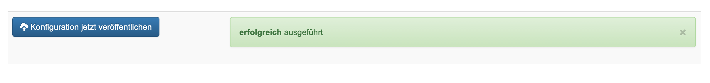
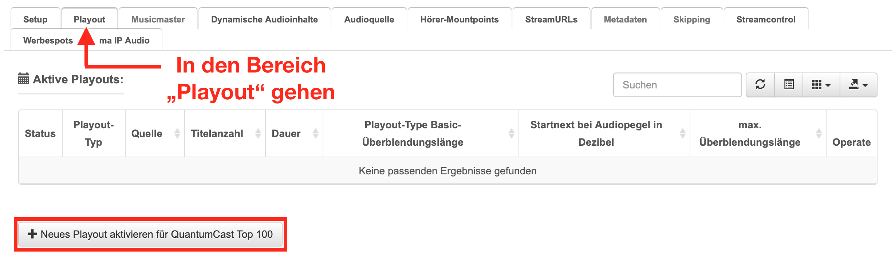
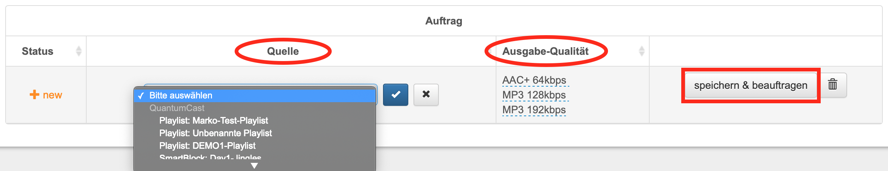
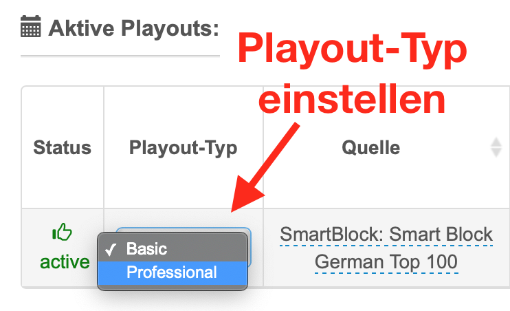
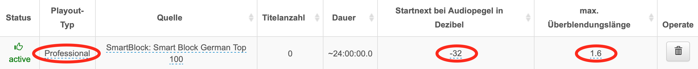
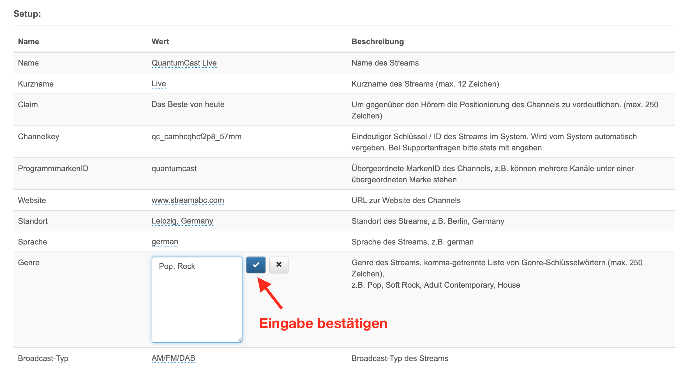
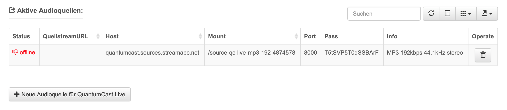
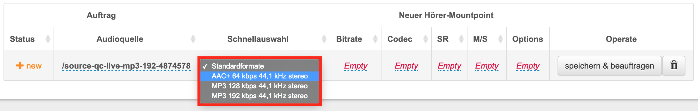
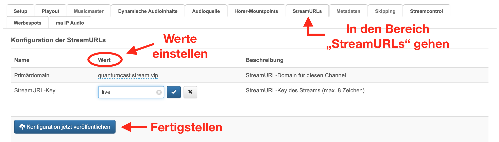
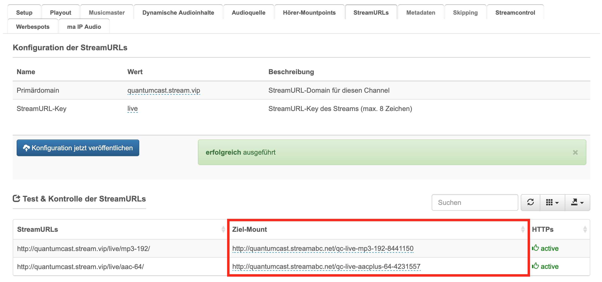

.. index:: channelservices

Channelservices
****************

----

.. index:: Einen neuen Channel erstellen mit Hilfe des PlaylistDesigners
.. index:: Symbole / Icons
.. index:: Die Hörerzahlen auf einen Blick

Einen neuen Channel erstellen mit Hilfe des PlaylistDesigners
==============================================================

Unter „Channelservices“ auf „Neu anlegen“ klicken und anschließen den Namen des Channels, die ProgrammmarkenID und die Audioquelle definieren. 

.. image:: img/PD_Channel_neu_anlegen.png

Die ProgrammmarkenID ist für jeden Nutzer vorgegeben. Sollte eine neue benötigt werden, können Sie sich an unseren Support wenden.

Die Audioquelle richtet sich danach, ob der Stream mit dem QuantumCast PlaylistDesigner erstellt wurde oder ob eine Audioquelle zugeliefert werden soll. Im Beispiel nutzen wir den PlaylistDesigner. Anschließend auf „Erstellen“ klicken und fertig.

Nun kann man das Setup des Channels einstellen. Wichtig: jede Eingabe mit einem Klick auf den Haken bestätigen.

.. image:: img/PD_Setup_Channel.png

Die Angaben von Kurzname, Claim, Standort, Sprache, Genre etc. sind optional, helfen aber bei der Zulieferung an Aggregatoren und Vermarkter. Zur Finalisierung auf „Konfiguration jetzt veröffentlichen“ gehen und der Channel ist erstellt.

Nun muss das Playout für den Channel eingerichtet werden. Dafür im Menü „Playout“ anwählen und auf „+ Neues Playout aktivieren“ klicken.

Dann kann man die Quelle und die Ausgabe-Qualität einstellen. Die Quelle ist hierbei eine im PlaylistDesigner erstellte und abgespeicherte Playlist bzw. ein Smartblock. Die Ausgabe-Qualität enthält automatisch eine Voreinstellung (siehe unten) - mit einem Klick darauf, können aber weitere Einstellungen getroffen werden. Am Ende auf „speichern & beauftragen“ gehen. Achtung: dies kann einige Sekunden dauern. Bitte warten bis der Prozess beendet ist.

Wurde das Playout erfolgreich gespeichert, kann man noch weitere Modifikationen vornehmen. In der Grundeinstellung ist als Playout-Typ „Basic“ eingestellt - der Funktionsumfang ist auf Basis-Funktionalitäten begrenzt. Für professionelle Online-Audio-Produzenten empfiehlt sich die Einstellung „Professional“.

Den Unterschied machen Funktionen, wie z.B. die individuelle Einstellung des Mixing und Soundprocessing aus. Die Nutzung von „Stereo Tool“ ist ebenfalls ein Teil des „Professional“-Playout. In der „Basic“-Version sind diese Möglichkeiten deaktiviert.

.. image:: img/PD_Playout_Typ_Basic.png

Sobald man sich für „Professional“ entscheidet, wird der erweiterte Funktionsumfang freigeschaltet - die Abrechnung erfolgt automatisch.

.. seealso:: `Video-Tutorial "StartNext" <https://www.youtube.com/watch?v=PuMSmgWzTe4>`_

Achtung! In unserem Beispiel ist die Anzahl der Titel „0“. Das bedeutet in diesem Fall nicht, dass keine Elemente in der Liste vorhanden sind, sondern es handelt sich um einen „Dynamischen Smartblock“. Da in diesem Fall die Längen variieren, weil die Abfolge automatisch immer neu erstellt wird, kann die Titelanzeige in diesem Fall kein eindeutiges Ergebnis liefern. Bei „Playlisten“ und „statischen Smartblöcken“ wird aber die korrekte Titelanzahl angezeigt.

Um etwas hören zu können, wie nun noch eine streamURL benötigt. 

.. image:: img/PD_Channel_StreamURL_Einstellung.png

Dafür in den Bereich „StreamURLs“ gehen und in der Spalte „Wert“ eine Domain auswählen und einen StreamURL-Key festlegen. Anschließend auf „Konfiguration jetzt veröffentlichen“ klicken. Dann erstellen sich automatisch die StreamURLs entsprechend der vorher definierten „Ausgabe-Qualität“.

Unter „Test & Kontrolle“ bekommt man schließlich die StreamURLs und die Ziel-Mountpoints angezeigt.

.. image:: img/PD_Channel_StreamURL-fertig.png

.. seealso:: `Video-Tutorial "Einen Channel erstellen" <https://www.youtube.com/watch?v=YBApG9pms8c>`_ 

Einen Channel erstellen mit einer eigenen Audioquelle
=======================================================

Unter „Channelservices“ auf „Neu anlegen“ klicken und anschließen den Namen des Channels, die ProgrammmarkenID und die Audioquelle definieren. 

.. image:: img/EA_Channel_neu_anlegen.png

Die ProgrammmarkenID ist für jeden Nutzer vorgegeben, eine neue kann nur über den Support beantragt werden. Wenn das Audiosignal fertig angeliefert wird „eigene Audioquelle“ auswählen und auf „Erstellen“ klicken.

Nun, wie bereits unter Punkt 2.2.1 beschrieben, das Setup des Channels einstellen und die Eingabe jeweils mit einem Klick auf den Haken bestätigen.

Anschließend muss die externe Audioquelle hinzugefügt und definiert werden. Dafür in den Menüpunkt „Audioquelle“ gehen und „+ Neue Audioquelle“ anklicken.

.. image:: img/EA_Audioquelle_hinzufuegen.png

Wer eines der Standardformate nutzt, kann dies unter „Schnellauswahl“ anwählen und auf die Eingabe von Bitrate, Codec, Samplingrate (SR) und Mono/Stereo (M/S) verzichten. Ansonsten müssen diese Informationen angegeben werden.

.. image:: img/EA_Audioquelle_Standard.png

Die Audioquelle kann angeliefert (PUSH) oder durch die QuantumCast-Plattform abgeholt werden (GET). Man kann sich zwischen PUSH und GET individuell für jede Source entscheiden und selbst in der Console konfigurieren.

Der gängigere Weg ist der erste, also das die Audio-Produzenten das Signal an die QuantumCast Console schicken (PUSH). Die Anlieferung erfolgt über die Icecast-Software. Beim zweiten Weg (GET) wird eine URL zur Abholung benötigt. Außerdem ist es wichtig, den Zugang durch die Firewall zu gewähren. Bei PUSH-Lieferungen kann dieses Feld frei gelassen werden.

.. image:: img/EA_AudioquelleURL.png

Schließlich noch „speichern & beauftragen“ anklicken und die Audioquelle ist fertig eingerichtet.

.. image:: img/EA_Audioquelle_Speichern.png

Am Ende erhält man einen Überblick über die Werte seiner Audioquelle. Diese Angaben benötigen die Audio-Produzenten, um Ihr Signal an die QuantumCast-Platform zu schicken (PUSH).

Nun müssen noch die Hörer-Mountpoints angelegt werden. Dafür in den entsprechenden Bereich gehen und „+ Neuer Hörer-Mountpoint“ anwählen.

.. image:: img/EA_HoererMountpoint_hinzufuegen.png

Anschließend die bereits angelegte „Audioquelle“  auswählen. Das Schnellauswahl-Menü bei „Neuer Hörer-Mountpoint“ funktioniert analog zum Einrichten der Audioquelle: nutzt man die Standardformate, kann man auf die Eingabe von Bitrate, Codec, Samplingrate (SR) und Mono/Steroe (M/S) verzichten. Ansonsten müssen diese Werte angegeben werden. Dann noch „speichern & beauftragen“ und fertig.

Der Audio-Produzent kann für jede Audioquelle mehrere Hörer-Mountpoints anlegen. Wenn Bitrate, Codec, SR und M/S übereinstimmen, erfolgt kein Transcoding, ansonsten wird das Transcoding automatisch gestartet.

.. image:: img/EA_HoererMountpoints_fertig.png

Zu 1.: Hier war die Audioquelle „MP3 192 kbps 44,1 kHz stereo“ - da der Hörer-Mountpoint die selbe Einstellung hat, erfolgte kein Transcoding.

Zu 2.: Die Audioquelle war hier ebenfalls das Standardformat „MP3 192 kbps 44,1 kHz stereo“. Da der Hörer-Mountpoint mit „AAC+ 64 kbps 44,1 kHz stereo“ ein anderes Format hatte, startete automatisch das Transcoding.

Unten bestimmten Umständen kann es sinnvoll sein, ein Transcoding durchzuführen, auch wenn Audioquelle und Hörer-Mountpoint übereinstimmen. Dafür muss man unter „Options“ einen Haken bei „Erzwinge Transcoding“ setzen.

.. image:: img/EA_HoererMountpoints_Transcoding_erzwingen.png

Es ist jedem Audio-Produzenten selbst überlassen, ob er ein Signal anliefert und das in verschiedene Ausgabe-Formate transcodiert oder ob er mehrere Audioquellen in verschiedenen Qualitätsstufen anliefert, um ein Transcoding zu vermeiden.

Abschließend unter „StreamURLs“ die „Primärdomain“ auswählen und einen StreamURL-Key festlegen. Dann „Konfiguration jetzt veröffentlichen“ anklicken.

Nun erhält man die entsprechenden Ziel-Mounts zur Konfiguration.

