.. index:: channelservices

Channelservices
****************

----

.. index:: Einen neuen Channel erstellen mit Hilfe des PlaylistDesigners
.. index:: Symbole / Icons
.. index:: Die Hörerzahlen auf einen Blick

Einen neuen Channel erstellen mit Hilfe des PlaylistDesigners
==============================================================

Unter „Channelservices“ auf „Neu anlegen“ klicken und anschließen den Namen des Channels, die ProgrammmarkenID und die Audioquelle definieren. 

.. image:: img/PD_Channel_neu_anlegen.png

Die ProgrammmarkenID ist für jeden Nutzer vorgegeben. Sollte eine neue benötigt werden, können Sie sich an unseren Support wenden.

Die Audioquelle richtet sich danach, ob der Stream mit dem QuantumCast PlaylistDesigner erstellt wurde oder ob eine Audioquelle zugeliefert werden soll. Im Beispiel nutzen wir den PlaylistDesigner. Anschließend auf „Erstellen“ klicken und fertig.

Nun kann man das Setup des Channels einstellen. Wichtig: jede Eingabe mit einem Klick auf den Haken bestätigen.

.. image:: img/PD_Setup_Channel.png

Die Angaben von Kurzname, Claim, Standort, Sprache, Genre etc. sind optional, helfen aber bei der Zulieferung an Aggregatoren und Vermarkter. Zur Finalisierung auf „Konfiguration jetzt veröffentlichen“ gehen und der Channel ist erstellt.

.. image:: img/PD_Konfiguration_veroeffentlichen.png

Nun muss das Playout für den Channel eingerichtet werden. Dafür im Menü „Playout“ anwählen und auf „+ Neues Playout aktivieren“ klicken.

.. image:: img/PD_Playout.png

Dann kann man die Quelle und die Ausgabe-Qualität einstellen. Die Quelle ist hierbei eine im PlaylistDesigner erstellte und abgespeicherte Playlist bzw. ein Smartblock. Die Ausgabe-Qualität enthält automatisch eine Voreinstellung (siehe unten) - mit einem Klick darauf, können aber weitere Einstellungen getroffen werden. Am Ende auf „speichern & beauftragen“ gehen. Achtung: dies kann einige Sekunden dauern. Bitte warten bis der Prozess beendet ist.

.. image:: img/PD_Playout_einstellen.png

Wurde das Playout erfolgreich gespeichert, kann man noch weitere Modifikationen vornehmen. In der Grundeinstellung ist als Playout-Typ „Basic“ eingestellt - der Funktionsumfang ist auf Basis-Funktionalitäten begrenzt. Für professionelle Online-Audio-Produzenten empfiehlt sich die Einstellung „Professional“.

.. image:: img/PD_Playout_Typ_einstellen.png

Den Unterschied machen Funktionen, wie z.B. die individuelle Einstellung des Mixing und Soundprocessing aus. Die Nutzung von „Stereo Tool“ ist ebenfalls ein Teil des „Professional“-Playout. In der „Basic“-Version sind diese Möglichkeiten deaktiviert.

.. image:: img/PD_Playout_Typ_Basic.png

Sobald man sich für „Professional“ entscheidet, wird der erweiterte Funktionsumfang freigeschaltet - die Abrechnung erfolgt automatisch.

.. image:: img/PD_Playout_Typ_Professional.png

.. seealso:: `Video-Tutorial "StartNext" <https://www.youtube.com/watch?v=PuMSmgWzTe4>`_

Achtung! In unserem Beispiel ist die Anzahl der Titel „0“. Das bedeutet in diesem Fall nicht, dass keine Elemente in der Liste vorhanden sind, sondern es handelt sich um einen „Dynamischen Smartblock“. Da in diesem Fall die Längen variieren, weil die Abfolge automatisch immer neu erstellt wird, kann die Titelanzeige in diesem Fall kein eindeutiges Ergebnis liefern. Bei „Playlisten“ und „statischen Smartblöcken“ wird aber die korrekte Titelanzahl angezeigt.

Um etwas hören zu können, wie nun noch eine streamURL benötigt. 

.. image:: img/PD_Channel_StreamURL_Einstellung.png

Dafür in den Bereich „StreamURLs“ gehen und in der Spalte „Wert“ eine Domain auswählen und einen StreamURL-Key festlegen. Anschließend auf „Konfiguration jetzt veröffentlichen“ klicken. Dann erstellen sich automatisch die StreamURLs entsprechend der vorher definierten „Ausgabe-Qualität“.

Unter „Test & Kontrolle“ bekommt man schließlich die StreamURLs und die Ziel-Mountpoints angezeigt.

.. image:: img/PD_Channel_StreamURL-fertig.png

.. seealso:: `Video-Tutorial "Einen Channel erstellen" <https://www.youtube.com/watch?v=YBApG9pms8c>`_ 

Einen Channel erstellen mit einer eigenen Audioquelle
=======================================================

Unter „Channelservices“ auf „Neu anlegen“ klicken und anschließen den Namen des Channels, die ProgrammmarkenID und die Audioquelle definieren. 

.. image:: img/EA_Channel_neu_anlegen.png

Die ProgrammmarkenID ist für jeden Nutzer vorgegeben, eine neue kann nur über den Support beantragt werden. Wenn das Audiosignal fertig angeliefert wird „eigene Audioquelle“ auswählen und auf „Erstellen“ klicken.

Nun, wie bereits unter Punkt 2.2.1 beschrieben, das Setup des Channels einstellen und die Eingabe jeweils mit einem Klick auf den Haken bestätigen.

.. image:: img/EA_Setup_Channel.png

Anschließend muss die externe Audioquelle hinzugefügt und definiert werden. Dafür in den Menüpunkt „Audioquelle“ gehen und „+ Neue Audioquelle“ anklicken.

.. image:: img/EA_Audioquelle_hinzufuegen.png

Wer eines der Standardformate nutzt, kann dies unter „Schnellauswahl“ anwählen und auf die Eingabe von Bitrate, Codec, Samplingrate (SR) und Mono/Stereo (M/S) verzichten. Ansonsten müssen diese Informationen angegeben werden.

.. image:: img/EA_Audioquelle_Standard.png

Die Audioquelle kann angeliefert (PUSH) oder durch die QuantumCast-Plattform abgeholt werden (GET). Man kann sich zwischen PUSH und GET individuell für jede Source entscheiden und selbst in der Console konfigurieren.

Der gängigere Weg ist der erste, also das die Audio-Produzenten das Signal an die QuantumCast Console schicken (PUSH). Die Anlieferung erfolgt über die Icecast-Software. Beim zweiten Weg (GET) wird eine URL zur Abholung benötigt. Außerdem ist es wichtig, den Zugang durch die Firewall zu gewähren. Bei PUSH-Lieferungen kann dieses Feld frei gelassen werden.

.. image:: img/EA_AudioquelleURL.png

Schließlich noch „speichern & beauftragen“ anklicken und die Audioquelle ist fertig eingerichtet.

.. image:: img/EA_Audioquelle_Speichern.png

Am Ende erhält man einen Überblick über die Werte seiner Audioquelle. Diese Angaben benötigen die Audio-Produzenten, um Ihr Signal an die QuantumCast-Platform zu schicken (PUSH).

.. image:: img/EA_Audioquelle_fertig.png

Nun müssen noch die Hörer-Mountpoints angelegt werden. Dafür in den entsprechenden Bereich gehen und „+ Neuer Hörer-Mountpoint“ anwählen.

.. image:: img/EA_HoererMountpoint_hinzufuegen.png

Anschließend die bereits angelegte „Audioquelle“  auswählen. Das Schnellauswahl-Menü bei „Neuer Hörer-Mountpoint“ funktioniert analog zum Einrichten der Audioquelle: nutzt man die Standardformate, kann man auf die Eingabe von Bitrate, Codec, Samplingrate (SR) und Mono/Steroe (M/S) verzichten. Ansonsten müssen diese Werte angegeben werden. Dann noch „speichern & beauftragen“ und fertig.

.. image:: img/EA_HoererMountpoint_Standard.png

Der Audio-Produzent kann für jede Audioquelle mehrere Hörer-Mountpoints anlegen. Wenn Bitrate, Codec, SR und M/S übereinstimmen, erfolgt kein Transcoding, ansonsten wird das Transcoding automatisch gestartet.

.. image:: img/EA_HoererMountpoints_fertig.png

Zu 1.: Hier war die Audioquelle „MP3 192 kbps 44,1 kHz stereo“ - da der Hörer-Mountpoint die selbe Einstellung hat, erfolgte kein Transcoding.

Zu 2.: Die Audioquelle war hier ebenfalls das Standardformat „MP3 192 kbps 44,1 kHz stereo“. Da der Hörer-Mountpoint mit „AAC+ 64 kbps 44,1 kHz stereo“ ein anderes Format hatte, startete automatisch das Transcoding.

Unten bestimmten Umständen kann es sinnvoll sein, ein Transcoding durchzuführen, auch wenn Audioquelle und Hörer-Mountpoint übereinstimmen. Dafür muss man unter „Options“ einen Haken bei „Erzwinge Transcoding“ setzen.

.. image:: img/EA_HoererMountpoints_Transcoding_erzwingen.png

Es ist jedem Audio-Produzenten selbst überlassen, ob er ein Signal anliefert und das in verschiedene Ausgabe-Formate transcodiert oder ob er mehrere Audioquellen in verschiedenen Qualitätsstufen anliefert, um ein Transcoding zu vermeiden.

.. image:: img/EA_Channel_StreamURL_Einstellung.png

Abschließend unter „StreamURLs“ die „Primärdomain“ auswählen und einen StreamURL-Key festlegen. Dann „Konfiguration jetzt veröffentlichen“ anklicken.

Nun erhält man die entsprechenden Ziel-Mounts zur Konfiguration.

.. image:: img/EA_ZielMount.png

Arbeiten mit Dynamischen Audioinhalten
=======================================

Mit Hilfe Dynamischer Audioinhalte lassen sich komplexe Programme einfach und schnell erstellen. Pro Channel können beliebig viele externe Audioquellen wie Podcast-Feeds oder Playlisten (PlaylistDesigner), eingebunden werden. Durch zahlreiche Konfigurationsmöglichkeiten können die Elemente termingenau geplant werden, es lassen sich verschiedene Aktivitätszeiträume definieren und die Auswahl der dynamischen Audioelemente kann beschränkt werden. Diese Art der Programmerstellung eignet sich beispielsweise hervorragend für die Planung von regelmäßig aktualisierten Nachrichten oder für Programme mit hohen Anforderungen an die Abfolge der Elemente.

Achtung! Um mit Dynamischen Audioinhalten arbeiten zu können, muss die Audioquelle des Channels der PlaylistDesigner sein (siehe 2.2.1).

Um nun einen Podcast einzubinden, in den Menüpunkt „Dynamische Audioinhalte“ gehen. Hier muss der Status auf „Aktiviert“ gesetzt und mit einem Klick auf den Haken bestätigt werden.

.. image:: img/DA_aktivieren.png

Nun mit „+ Podcast-Quelle hinzufügen“ eine neue Quelle anlegen.

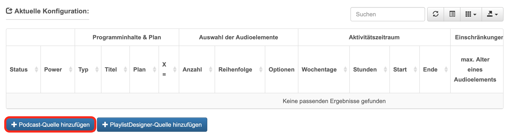

Dann die URL des Podcasts angeben und mit „speichern und beauftragen“ den Auftrag abschließen.

.. image:: img/DA_URL_hinzufuegen.png

Jetzt muss die Audioquelle konfiguriert werden. Standardmäßig wird die Übersicht in einer Tabelle angezeigt. Es ist jedoch auch möglich, sich einen Überblick in der Listenansicht zu verschaffen. Außerdem können einige Spalten der Tabelle dazu- oder ausgeblendet werden. 

.. image:: img/DA_Ansichten_Tabelle.png

Nun müssen „Programminhalte und Plan“ konfiguriert werden. Der Titel wurde anhand der Metadaten der PodcastURL automatisch erstellt.

.. image:: img/DA_Playlist_Programminhalte.png

Zuerst muss der „Typ“ bestimmt werden. Das ist wichtig, da verschiedene Typen in den Sendeprotokollen unterschiedlich ausgewiesen werden. Außerdem werden die Metadaten bei verschiedenen Typen unterschiedlich ausgelesen.

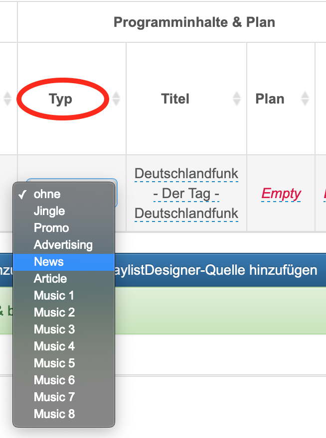

Dann kann man festlegen, wie oft das Element eingeplant werden soll. Anschließend noch den Wert für „X“ festlegen. Hier würde sich für Nachrichten zum Beispiel „0“ eignen - dann laufen die News immer am Anfang einer Stunde.

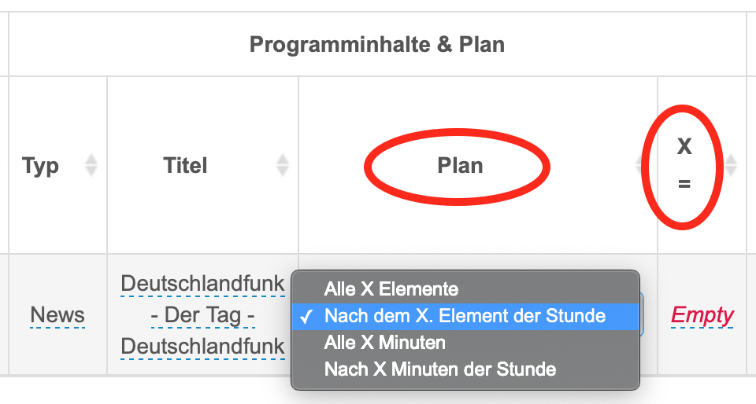

Nun erfolgt die „Auswahl der Audioelemente“. Bei Nachrichten bietet es sich natürlich an, mit dem neuesten Element zu beginnen. Für andere Audio-Beiträge können natürlich auch andere Möglichkeiten sinnvoll sein.

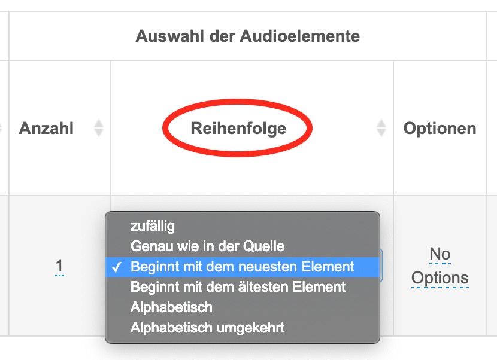

Unter „Optionen“ hätte man noch die Möglichkeit „bereits gespielte Elemente merken“ anzuklicken. Diese Elemente würde dann erstmal nicht mehr eingeplant werden. Für Nachrichten wird diese Option nicht benötigt, es könnte aber beispielsweise bei einem Hörspiel von Vorteil sein.

.. image: img/DA_Audioinhalte_Optionen.png

Als nächstes muss man den „Aktivitätszeitraum“ des Podcasts definieren.

.. image:: img/DA_Aktivitaetszeitraum.png

Zum Verändern der „Wochentage“ einfach auf den voreingestellten Wert klicken und die eigene Auswahl treffen. Dann mit einem Klick auf den Haken die Eingabe bestätigen. Die Einstellung der „Stunden“ funktioniert genauso.

.. image:: img/DA_Aktivitaetszeitraum_Tage.png

Nun müssen bei „Start“ und „Ende“ noch die Daten und Zeiten eingeben werden, zwischen denen der Podcast aktiv sein soll. Hierbei wird erst das Datum und dann die Uhrzeit eingegeben.

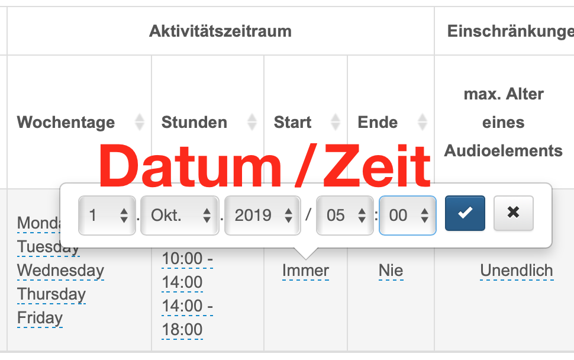

Damit alte Podcast-Elemente nicht ewig gespielt werden, kann man bei „Einschränkungen“ das „max. Alter eines Audioelements“ bestimmen.

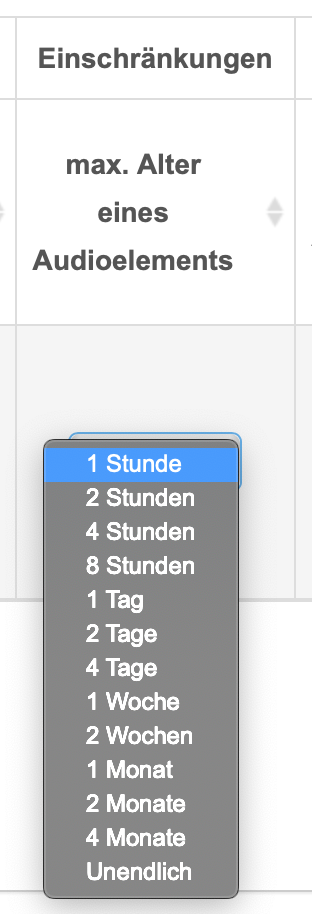

Und schließlich gibt es auch bei Dynamischen Audioinhalten die Möglichkeit das Mixing durch individuelle Einstellungen zu verfeinern. 

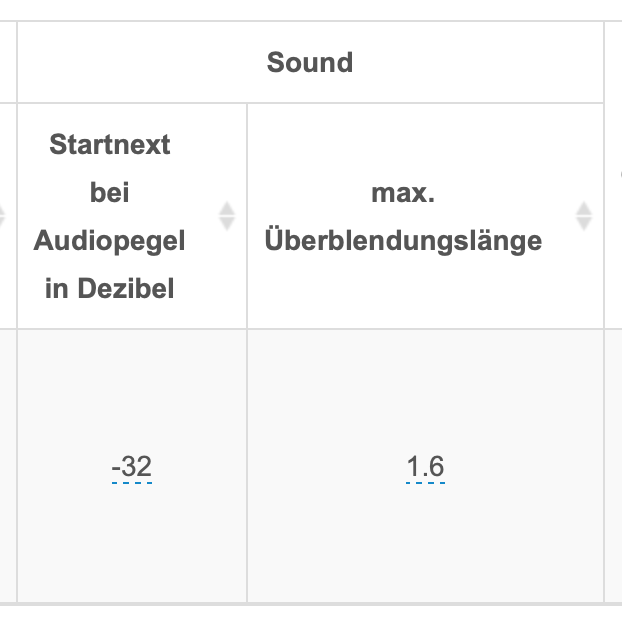

Um die Podcast-Elemente zu aktivieren, bei „Power“ auf „On“ schalte.

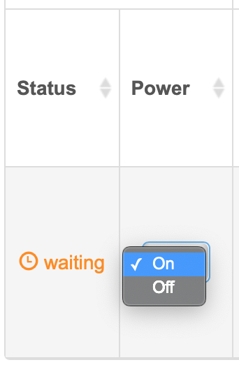

Sobald das Zeitfenster erreicht ist, in dem der Podcast eingeplant ist, wird der Status „active“ (grün) - außerhalb des definierten Zeitfensters steht er auf „waiting“ (orange).

.. image:: img/DA_Status_aktiv.png

Wenn man einen Podcasts nicht mehr benötigt, kann man ihn einfach löschen, indem man bei „Operate“ auf das Mülltonnen-Symbol klickt.

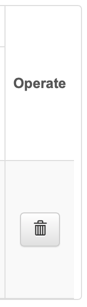

.. seealso:: `Video-Tutorial "Podcasts in Audiostreams" <https://www.youtube.com/watch?v=Ey_5WAHBBOU>`_ 

Es gibt nicht nur die Möglichkeit Podcasts in einen Channel einzubinden, man kann auch Playlisten aus dem PlaylistDesigner hinzufügen. Diese Variante bietet sich an, um sehr komplexe Programme zu erstellen. Hierfür bei Dynamische Audioinhalte auf  „PlaylistDesigner-Quelle hinzufügen“ klicken.

Anschließend eine im PlaylistDesigner erstellte Playlist/Smartblock auswählen und mit „speichern & beauftragen“ anlegen.

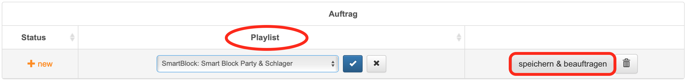

Nun noch den „Typ“ der Playlist einstellen und definieren, wie oft die Elemente im Programm auftauchen sollen. In diesem Fall wird alle fünf Elemente ein Titel aus dem Smartblock „Party & Schlager“ gespielt - der Rest des Programms wird mit dem unter „Playout“ festgelegtem Inhalt erstellt. 

.. image:: img/DA_Playlist_Programminhalte.png

Nun bestimmt man, wie die Audioelemente ausgewählt werden. Hier wird immer ein Element zufällig ausgewählt. Wichtig! Damit sich die Titel nicht ständig wiederholen, bei Optionen „bereits gespielte Elemente merken“ anwählen.

.. image:: img/DA_Playlist_Audioelemente.png

Analog zum Einfügen von Podcasts kann man auch bei Playlisten den „Aktivitätszeitraum“ und „Einschränkungen“ definieren. Während es bei Podcasts oft wichtig ist, das „max. Alter eines Audioelements“ festzulegen, könnte man bei Musiktiteln beispielsweise auch „Unendlich“ einstellen, um die Auswahl nicht einzuschränken. 

.. image:: img/DA_Playlist_Aktivitaet_Einschraenkungen.png

Zum Schluss noch das Mixing anpassen und fertig.

.. image:: img/DA_Playlist_Soundprocessing.png

Unter „Dynamische Audioinhalte“ findet man, wenn man nach unten scrollt, auch die Sendeprotokolle des Channels. Unterschiedlichen Elementen (z.B. Musik, News, Jingles, Werbung) sind darin unterschiedliche Farben zugewiesen. Die aktuellsten Elemente der Stunde werden immer zuerst angezeigt

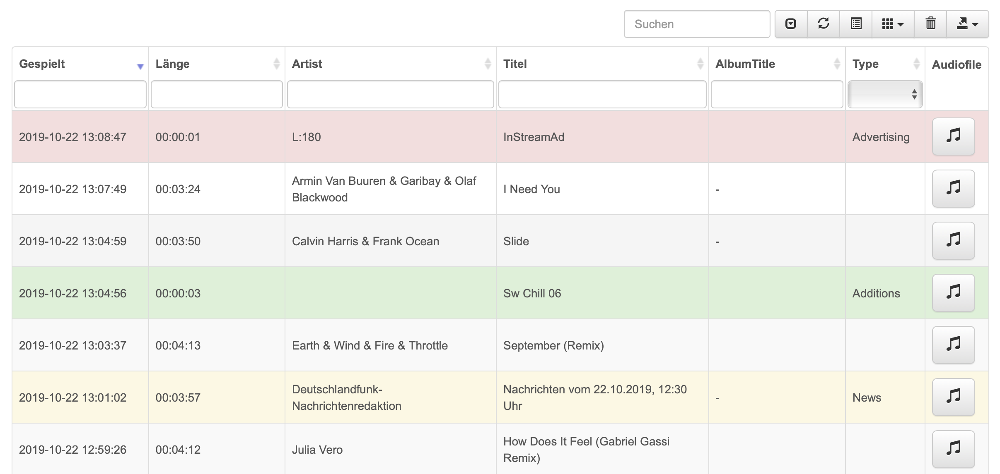

Unter „Protokoll“ kann man gezielt nach bestimmten Daten suchen, um die Sendeprotokolle einzelner Tage zu analysieren.

.. image:: img/DA_Protokoll_Datum.png

Es ist auch möglich, die einzelnen Spalten des Sendeprotokolls ein- und ausblenden.

.. image:: img/DA_Protokoll_Spalten.png

Für die weitere Verarbeitung lassen sich die Sendeprotokolle in verschiedenen Formaten exportieren. Dafür einfach auf den entsprechenden Button klicken und das gewünschte Format auswählen.

.. image:: img/DA_Protokoll_Export.png

.. seealso:: `Video-Tutorial "Arbeiten mit Sendeprotokollen" <https://www.youtube.com/watch?v=_ZqDgnfCU8M>`_ 

