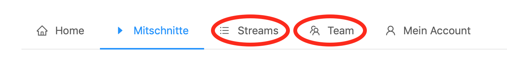
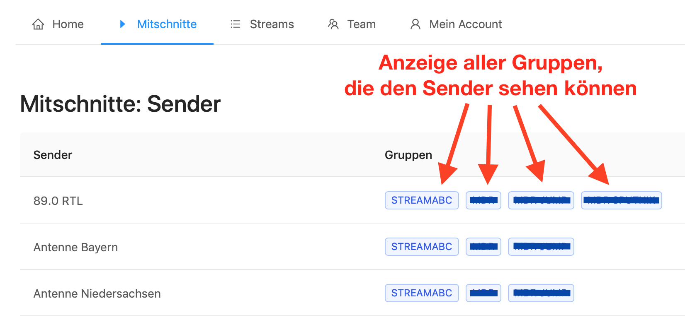
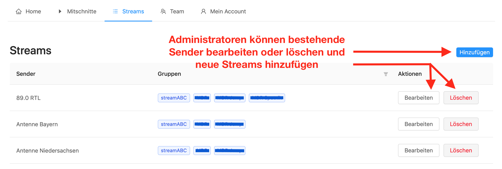
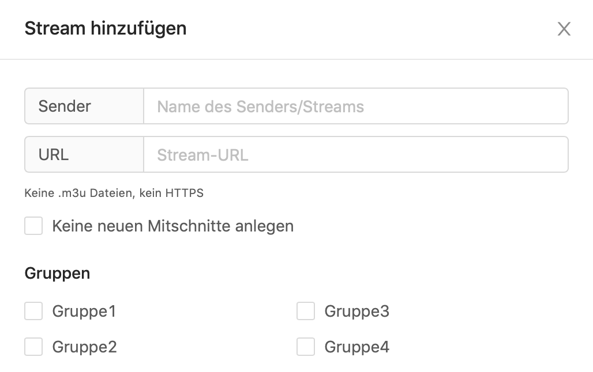
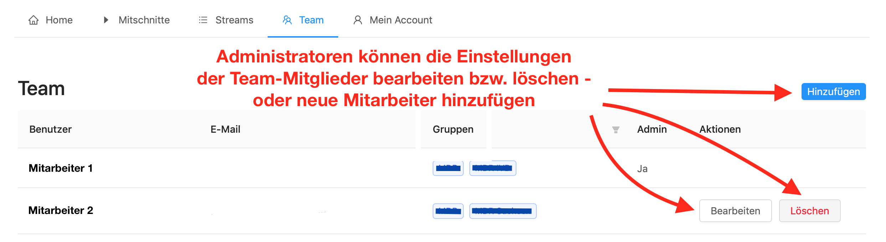
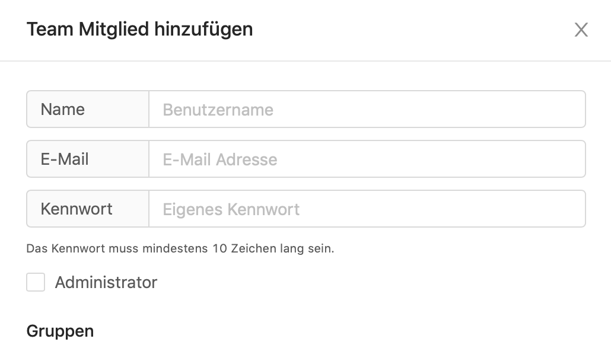

.. index:: Administrator

Administrator
***********

Über die Weboberfläche in den Streamrecorder einloggen. Im Gegensatz zu normalen Usern, sehen Administratoren zusätzlich die Menüpunkte „Streams“ und „Team“. Hier lassen sich die mitgeschnittenen Sender und die Rechte der einzelnen Team-Mitglieder verwalten.

Außerdem werden den Administratoren alle den jeweiligen Sendern zugeordneten Gruppen angezeigt - normale User sehen dagegen nur ihre eigene Gruppe.

Im Bereich „Streams“ lassen sich die einzelnen Sender, die man mitschneiden möchte,  bearbeiten oder löschen.

Oder man fügt einen neuen Stream hinzu - dafür benötig man lediglich Titel und streamURL. Anschließend kann man den Stream noch einzelnen Nutzer-Gruppen zuweisen.

Ähnlich den Sendern kann der Administrator auch die einzelnen User verwalten. Sollten sich zum Beispiel E-Mail-Adressen oder Gruppen-Zugehörigkeiten ändern, lässt sich dies einfach und schnell bearbeiten.

Über die Schaltfläche „Hinzufügen“ können neue Mitarbeiter dem Team hinzugefügt werden.

----

BBei weiteren Fragen bitte ein Ticket öffnen: |helpdesk|

Besuchen Sie unsere Unternehmens-Website |www.quantumcast-digital.de|

.. |helpdesk| raw:: html

    <a href="https://streamabc.zammad.com" target="_blank">https://streamabc.zammad.com</a>

.. |www.quantumcast-digital.de| raw:: html

   <a href="https://www.quantumcast-digital.de" target="_blank">www.quantumcast-digital.de</a>

.. |Console| raw:: html

   <a href="https://www.quantumcast-digital.de" target="_blank">Console</a>
   
