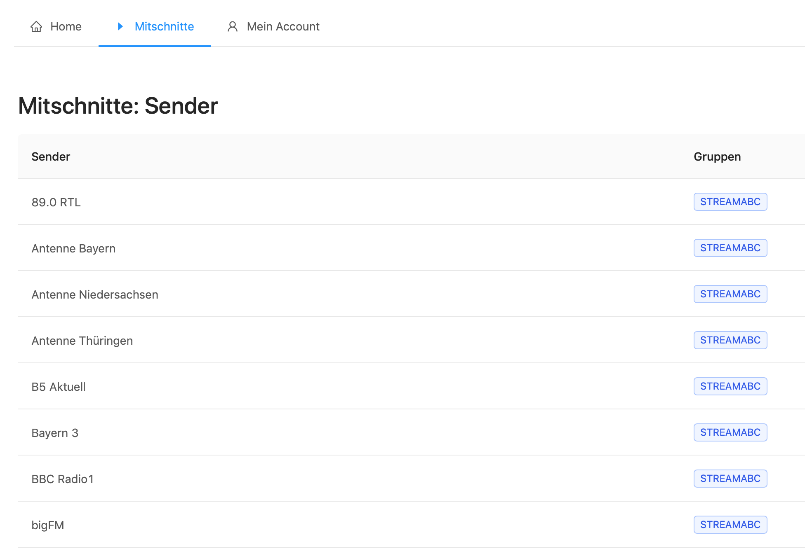

Streamrecorder
==============

Mit dem Streamrecorder lassen sich eigene und fremde Sender im Internet aufzeichnen, um die Inhalte genauer analysieren zu können. Je nach Berechtigung kann man sich als Administrator oder normaler User anmelden. 

..  toctree::
    :maxdepth: 2
    :caption: Inhalt 

    useroberflaeche
    administrator

* :ref:`genindex`
* :ref:`glossary`

----

Bei Fragen bitte ein Ticket öffnen: |helpdesk|

Besuchen Sie unsere Unternehmens-Website |www.streamabc.com|

.. |helpdesk| raw:: html

    <a href="https://streamabc.zammad.com" target="_blank">https://streamabc.zammad.com</a>

.. |www.streamabc.com| raw:: html

   <a href="https://www.streamabc.com/" target="_blank">www.streamabc.com</a>
   