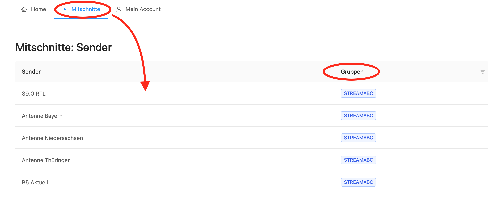
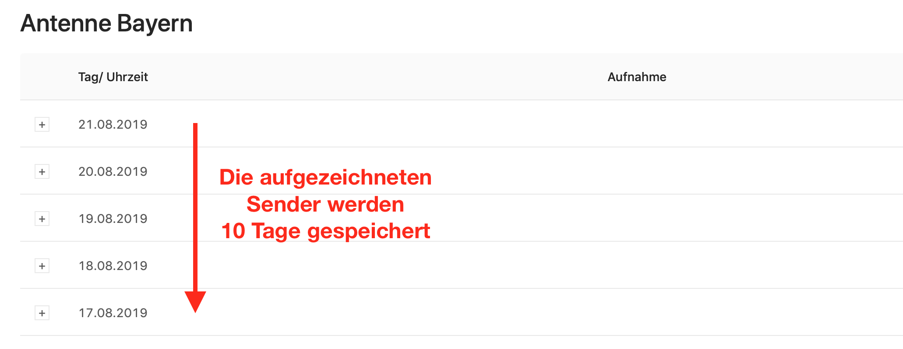
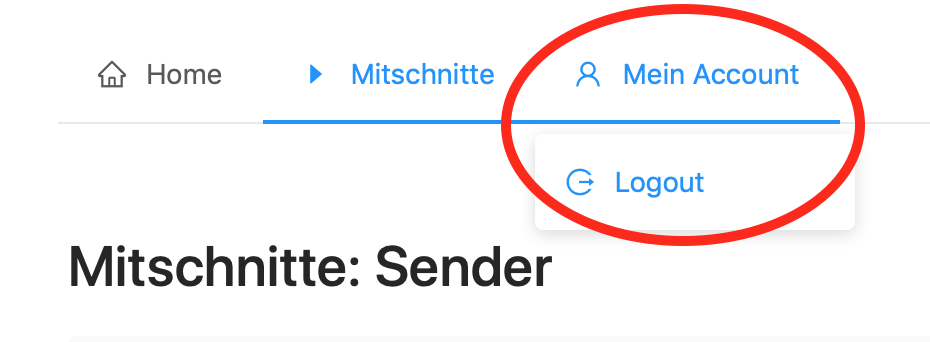

.. index:: User-Oberfläche

User-Oberfläche
***********

Nach dem Einloggen über die Weboberfläche des Streamrecorders gelangt man in den Home-Bereich. Hier erhält man einen Überblick über die zuletzt angesehenen Channels. 

Ein Klick auf „Mitschnitte“ und eine Liste aller Sender wird angezeigt. Welche man sieht, ist abhängig davon, für welche Gruppe man freigeschaltet ist. Die Freischaltung kann nur über einen User mit Administratoren-Funktion erfolgen.

Nun kann man jeden Sender durch einen einfachen Klick anwählen. Danach öffnet sich ein Überblick über die letzten zehn Tage. 

Durch einen Klick auf das „+“ -Zeichen, öffnet sich der Tag und man bekommt einen Überblick über jede einzelne Stunde. Hier kann man in den Channel reinhören oder ihn zur weiteren Nutzung herunterladen.

.. image:: img/Sender_Ueberblick_Stunde.png

Über „Mein Account“ und „Logout“ kann man den Streamrecorder wieder verlassen. 

----

Bei weiteren Fragen bitte ein Ticket öffnen: |helpdesk|

Besuchen Sie unsere Unternehmens-Website |www.streamabc.com|

.. |helpdesk| raw:: html

    <a href="https://streamabc.zammad.com" target="_blank">https://streamabc.zammad.com</a>

.. |www.streamabc.com| raw:: html

   <a href="https://www.streamabc.com/" target="_blank">www.streamabc.com/</a>

