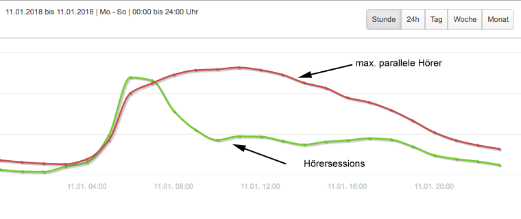
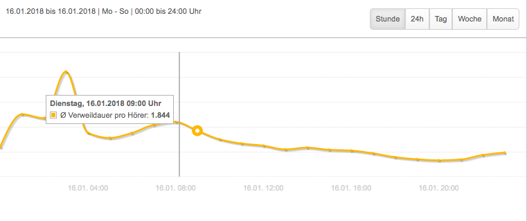

.. index:: Streamwatch FAQs

.. _streamwatch:

Streamwatch
***********

.. index:: Einbruch Hörersessions der letzten Stunden

Gibt es ein Problem, wenn die aktuellen Hörersessions der letzten Stunden eingebrochen sind?
--------------------------------------------------------------------------------------------

.. image:: img/20180117_screenshot-streamwatch-listener-decrease-last-hours.png

Wenn nur die letzten Stunden der akt. Hörersessions einbrechen, 
aber sonst alles normal aussieht, 
dann gibt es kein Problem. Das ist normal.

Man muss dazu wissen, dass eine Hörersession erst dann gezählt und angezeigt wird, 
wenn der Hörer die Verbindung beendet hat. Die Daten der Hörersession werden dann der Stunde des Streamstarts zugezählt.

Ein Beispiel dazu:
    Ein Hörer schaltet morgens um 8:00 Uhr den Stream ein, und nachmittags um 14:00 Uhr wieder ab.
    Erst nach Ende das Streams, also nach 14:00 Uhr werden die Daten zu dieser Hörersession verarbeitet, und die Kurve wächst etwas an.
    Ich kann also die Daten des Hörers nicht schon um 12:00 Uhr sehen. 
    
Somit ist es normal, dass umso näher man der aktuellen Zeit in der Grafik kommt, desto mehr geht die Kurve nach unten.
**Die Hörerkurve wächst mit der Zeit nach oben.**
Im Extremfall kann es Hörersessions geben, welche mehrere Tage lang andauern. 
Dann kann auch die Anzahl der Hörersessions von vor Tage noch leicht anwachsen.

----

.. index:: parallele Hörer
.. index:: maximale parallele Hörer

Wie ist es möglich, dass es mehr „max. parallele Hörer“ in einer Stunde gibt als Hörersessions?
-----------------------------------------------------------------------------------------------

Jede Hörersession wird nur einmal gezählt und der Stunde des Streamstarts zugewiesen. 
Die Daten für parallele Hörer werden anders ermittelt und gezählt. 
Um die Anzahl der max. parallelen Hörer zu bekommen schaut ein Sensor permanent auf die Anzahl der gerade verbundenen Hörer.
Der Maximalwert der Stunde wird in der roten Linie angezeigt.

Ein Beispiel aus der Grafik:
    Alle Hörer, die zwischen 6:00 und 7:00 Uhr den Stream einschalten, 
    werden in der grünen Linie am höchsten Punkt angezeigt. 
    Viele Hörer hörten den Stream nur kurz und zu unterschiedlichen Zeiten in der 6-7-Uhr-Stunde. 
    Dadurch gab es überdurchschnittlich viele Hörersessions in der Stunde. 
    Die Anzahl der gleichzeitig verbundenen Hörer stieg erst nach und nach an, weil immer wieder Hörersession beendet worden.
    Und es ist nur der höchste Wert in der Kurve „max. parallele Hörer“ dokumentiert.
    In der 9-10-Uhr-Stunde verhält es sich umgekehrt.
    Viele Hörer hörten den Stream über mehrere Stunden, werden aber nur in der 9-10-Uhr-Stunde bei Hörersessions einmal gezählt.
    Der Sensor für die Ermittlung der parallelen Hörer registriert auch in den Folgestunden die Hörer mit Streamstart aus der 9-10-Uhr-Stunde, solange bis diese Hörer abschalten.
    Somit ist es normal, dass max. parallelen Hörer deutlich höher sind als die Hörerseesion der Stunde.
    

    
----

.. index:: Ø Verweildauer pro Hörer
.. index:: Verweildauer pro Hörer

Was bedeutet "Ø Verweildauer pro Hörer"?
---------------------------------------------

Die durchschnittliche Hördauer in Stunden für jeden Hörer, mit einer Hördauer von mindestens einer Minute, innerhalb des definierten Zeitraumes. 
Dieser Wert wird berechnet: Gesamthördauer geteilt durch die Anzahl der Hörersessions des definierten Zeitraumes.

Ein Beispiel aus der Grafik:
    Die Verweildauer wird in Stunden angegeben. In diesem Beispiel beträgt der Wert 1.844 in der 9:00 Uhr-Stunde.
    Das heißt, dass von 9:00 Uhr bis 10:00 Uhr ein Hörer im Durchschnitt eine Hördauer von 1,844 Stunden hatte.
    1,844 Stunden = 110 Minuten und 38 Sekunden.

.. seealso:: `Glossar: Ø Verweildauer pro Hörer </de/latest/glossary.html#o-verweildauer-pro-horer>`_

----

.. index:: Hörer mit Hördauer >60s

Was bedeutet "Hörer mit Hördauer >60s"?
---------------------------------------------

"Hörer mit Hördauer >60s" bedeutet, dass nur Streamingsessions gezählt werden, welche mindestens 60 Sekunden lang den Stream gehalten haben.
Ohne schnick Schnack ... keine unique User. Kein Zusammenzählen von mehreren Sessions.

.. seealso:: `Glossar: Hörer mit Hördauer >60s </de/latest/glossary.html#horer-mit-hordauer-60s>`_

----

.. index:: Unique User / Hörer
.. index:: Wiederkehrender Hörer 

Wie ermittelt man die Anzahl unterschiedlicher Hörer (Unique User / Hörer)?
---------------------------------------------

Gleich vorab die entscheidende Information: Es ist nicht einfach so möglich beim öffentlichen Audiostreaming die Anzahl der unterschiedlichen Hörer zur ermitteln.
Um die Anzahl der unterschiedlichen Hörer zählen zu können, müsste es möglich sein, einen wiederkehrenden Hörer zu erkennen. Das ist aber nur möglich, wenn man jedem Hörer eine eigene ID geben kann, die jedes Mal über die StreamURL mit übergeben wird. 
Es gibt aber keine Cookies in der Audiostreaming-Welt. Cookies gibt es nur im Browser. Audiostreams aber kann man nicht nur mit Web-Browsern hören, sondern auch mit alten WLAN-Radios, Sonos und anderen Playern.
Um den Unique User zu ermitteln, benötigt es deswegen außergewöhnlichen Entwickler-Aufwand.

Wenn Sie bereit sind eine außergewöhnliche Entwicklerleistung für die Ermittlung wiederkehrenden Hörer erbringen, dann bitte geben Sie uns Bescheid, indem Sie ein Ticket öffnen: 
|helpdesk| .  
Es gibt die Möglichkeit der Übergabe der Unique UserID über die StreamURL.

----

Bei weiteren Fragen bitte ein Ticket öffnen: |helpdesk|

Besuchen Sie unsere Unternehmens-Website |www.streamabc.com|

.. |helpdesk| raw:: html

    <a href="https://streamabc.zammad.com" target="_blank">https://streamabc.zammad.com</a>

.. |www.streamabc.com| raw:: html

   <a href="https://www.streamabc.com/#quantum-cast" target="_blank">www.streamabc.com/#quantum-cast</a>
   
   