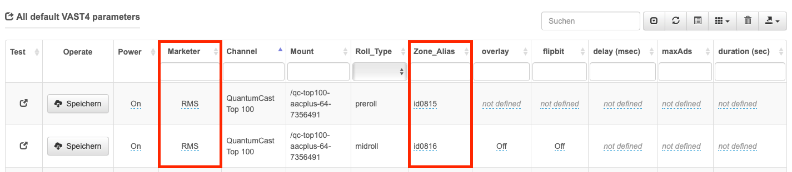

.. index:: Werbung

Allgemeines
****************

.. index:: Werbeformen

Werbeformen im Überblick
============================

Es gibt zwei Arten der automatischen Werbeeinblendung:

| **Preroll-Spots:** 
| Werbespots, die beim Start des Streams abgespielt wird

| **Midroll-Spots:**
| Werbespots, die mitten im Stream ausgespielt werden – den genauen Zeitpunkt legt der Programmanbieter über einen Trigger selbst fest

Im QuantumCast DasboardTV kann man sich die Verteilung beider Spot-Typen über einen bestimmten Zeitraum hinweg anzeigen lassen:

.. image:: img/Dashboard_Preroll_Midroll.png

Die gelben Punkte zeigen die Anzahl der ausgespielten Preroll-Spots, die blauen Linien die Midroll-Spots. Rechts neben dem Diagramm wird angezeigt, in welchem Verhältnis beider Werbeformen zueinanderstehen.

.. index:: Vermarkter
.. index:: Fillrate

Voraussetzungen für Werbeeinbindung
=======================================

Die Grundvoraussetzung, um Werbung in den Stream einbinden zu können, ist ein Vertrag mit einem Vermarkter. Ist dieser geschlossen, bekommt man einen Zonen-Alias, also einen Referenzschlüssel, auf den die Kampagnen gebucht werden. 

Im Bereich „Werbespots“ der QuantumCast Console müssen diese Angaben unter „All default VAST4 parameters“ eingetragen werden. 

Bei „Marketer“ den eigenen Vermarkter aus der Liste auswählen und anschließend die „Zone_Alias“ angeben – selbstverständlich jeweils für die Preroll- und Midroll-Spots.

Für Nutzer des QuantumCast Playouts reicht diese Einstellung, um Werbung professionell auszuspielen. Bei Kunden mit externer Audioquelle empfiehlt es sich, für die Midroll-Spots noch zusätzlich die Angaben für „overlay“, „flipbit“ und „drift“ zu ergänzen.

.. seealso:: `Mehr dazu hier <http://doku.streamabc.com/de/latest/werbekonfiguration/werbung_externeaudioquelle.html#grundlegende-einstellungen>`_ 

Wenn alle Einstellungen fertig getroffen sind, löst das Streamingsystem bei jedem Trigger eine Anfrage an den Vermarkter aus, ob für den jeweiligen Hörer Spots vorliegen. Gibt der Vermarkter eine positive Antwort, werden die Spots ausgespielt. Gleichzeitig wird automatisch ein Protokoll über die Werbeeinblendung erstellt und an den Vermarkter gesendet. 

Aber! Es kommt nur Werbung, wenn der Vermarkter es zulässt.

Hier einige Beispiele, warum Werbespots nicht ausgespielt werden, obwohl sie angefragt wurden:

* Die Werbung ist aufgebraucht, da der Werbetreibende nur eine bestimmte Menge an Spots einkauft hat

* Manche Werbetreibende wollen, dass ihre Werbung nur einmal pro Stunde läuft – ist das passiert, wird der Spot erst wieder in der folgenden Stunde ausgeliefert

* Werbung kann regional ausgeliefert werden – so kann es möglich sein, dass der Hörer in München den Spot einer ansässigen Brauerei bekommt, der Hamburger Hörer aber nicht

Sollten Sie Probleme haben, können Sie den Service von QuantumCast DashboardTV nutzen. Hier gibt einen Überblick über die „Fill rate“, die Ihnen sehr genau zeigt, wie das Verhältnis von angefragten zu tatsächlich ausgelieferten Spots ist.

.. image:: img/Dashboard_Spots_Fillrate.png

Ihr Vermarkter kann Ihnen ebenfalls bei der Klärung offener Fragen helfen.

.. index:: Werbe-Trigger 

Welche Werbe-Trigger gibt es
==============================

Ein Preroll-Sport beginnt automatisch mit dem Start des Streams. Bei Midroll-Spots benötigt es einen zusätzlichen Trigger, um die Werbung auszulösen. Wenn das Streamingsystem den Werbeimpuls bekommt, fragt es beim Vermarkter an, ob für diesen Hörer ein Spot vorliegt. Erhält es eine positive Antwort, wird der Stream kurz angehalten und die Werbung abgespielt.

Kunden, die das QuantumCast Playout nutzen, können alle Einstellungen dafür in der Console treffen. 

.. image:: img/Trigger_QCPLayout.png

Im Bereich „Werbespots“ lassen sich im Hand umdrehen neue Werbeblöcke hinzufügen und alle notwendigen Einstellungen treffen. Dabei wird festgelegt, alle wieviel Elemente oder Minuten die Spots laufen sollen (siehe 1.) und in welchem Zeitraume diese Einstellung aktiv ist (siehe 2.).

.. seealso:: `Werbekonfiguration mit dem QuantumCast-Playout <http://doku.streamabc.com/de/latest/werbekonfiguration/werbung_qcplayout.html>`_ 

**Metadaten:**
Im Audiostream werden Metadaten integriert - das Streamingsystem erkennt bestimmte Muster und startet dann die automatische Werbeeinblendung.

.. seealso:: `Wie der Auslöser des Werbeimpulses (Trigger) bei Metadaten aussehen muss <http://doku.streamabc.com/de/latest/faq/werbung.html#wie-muss-der-ausloser-des-werbeimpulses-trigger-bei-metadaten-aussehen>`_ 

**Beep-Erkennung:**
Im angelieferten Audiosignal wird ein spezieller Ton (Beep) versteckt - das Streamingsystem erkennt diesen Ton und startet zu diesem Zeitpunkt die automatische Werbeeinblendung.

.. index:: VAST4

Die VAST 4.0-Schnittstelle zum Vermarkter
=============================================

Über die VAST 4.0-Schnittstelle ist die QuantumCast-Plattform mit den Radiovermarktern verbunden. Die Technologie macht es möglich, dass darüber sehr viele Informationen über die Spots, das Werbeumfeld, aber auch über die Hörer ausgetauscht werden können.

So werden beispielsweise folgende Parameter übermittelt:

* die max. Anzahl an Spots

* die Länge der Werbung

* ListenerID

* Genre 

* Sprache 

* Ort

Über das Auswahlmenü im Bereich „All default VAST4 parameters“ der QuantumCast Console lassen sich alle Werte, die über VAST 4.0 übergeben werden können, auch als zusätzliche Spalte in der Tabelle einblenden.

.. image:: img/Auswahl_VAST4.png

Weitere Informationen zur Schnittstelle finden Sie auch im *AdsWizz VAST 4.0 Integration Guide*.

Priorisierung der Werbeeinstellung
=====================================

In der QuantumCast Console kann man an mehreren Stellen Einstellungen für die Werbung machen. Damit sich die Einstellungen gegenseitig nicht stören, nimmt das System eine Priorisierung vor: 

1. Systemstandard: damit funktioniert Werbung rudimentär; wird nur angewendet, wenn keine weiteren Einstellungen getroffen wurden

2. „All default VAST4-parameters“ in der QuantumCast Console

3. Werbe-Trigger: Für Kunden, die das Playout der QuantumCast Console nutzen, sind das die individuellen Planungseinstellungen. Bei Anlieferung einer externen Audioquelle erfolgt der Trigger über die Beep-Erkennung oder die Metadaten. Es kann beispielsweise auch die Länge des Werbeblocks und die maximale Anzahl der Spots per Metadaten-Trigger übergeben werden.

4. StreamURL: auch über die StreamURL können Informationen für die Werbeanbieter übergeben werden – an dieser Stelle überlagern die Informationen alle anderen.

----

Bei weiteren Fragen bitte ein Ticket öffnen: |helpdesk|

Besuchen Sie unsere Unternehmens-Website |www.quantumcast-digital.de|

.. |helpdesk| raw:: html

    <a href="https://streamabc.zammad.com" target="_blank">https://streamabc.zammad.com</a>

.. |www.quantumcast-digital.de| raw:: html

   <a href="https://www.quantumcast-digital.de" target="_blank">www.quantumcast-digital.de</a>

.. |Console| raw:: html

   <a href="https://www.quantumcast-digital.de" target="_blank">Console</a>
   
