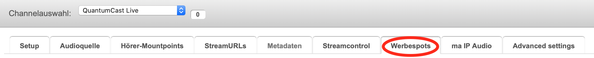
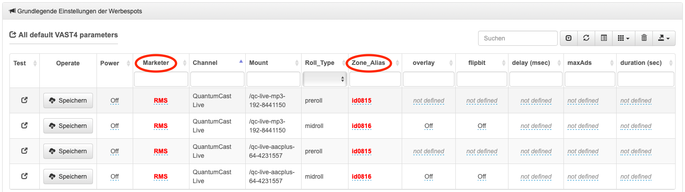
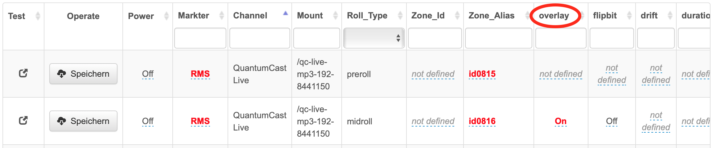
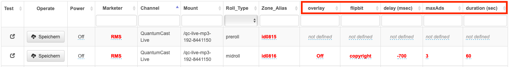

.. index:: Werbung

Werbung in externe Audioquellen einplanen
********************************************

Technische Voraussetzung
==========================

Wenn ein Kunde für seinen Stream eine eigene Audioquelle anliefert, dann handelt es sich meist um den Simulcast. Dieser beinhaltet bereits Werbung, wird aber für die Verbreitung übers Internet durch zusätzliche Spots ergänzt. Den Impuls (Trigger) zum Auslösen der Werbung muss der Kunde über die Schnittstelle zur QuantumCast Plattform mitliefern. Dies kann über die Metadaten oder mittels Beep-Erkennung funktionieren. 
 
Wenn der Trigger über die Metadaten übermittelt wird, erkennt das Streamingsystem die entsprechenden Informationen und startet die Werbung. Der große Vorteil ist, dass der Kunde über die Metadaten auch die max. Länge der Spots oder die Anzahl der Spots pro Trigger konfigurieren kann.

| "InStreamAd L:x": Adbreak von max. x Sekunden 
| "InStreamAd N:x": Adbreak für max. x Spots

Ist für die Werbezeit ein Musikbett/Filler eingeplant, muss nichts weiter beachtet werden. Es gibt aber auch die Möglichkeit den Stream für die Dauer der Werbung anzuhalten. Dann muss berücksichtigt werden, dass jedem Hörer individuelle Spots mit unterschiedlicher Spieldauer ausgeliefert werden. Das verändert den Versatz zum eigentlichen Programm und dessen Metadaten. Um weiterhin eine synchrone Anzeige im Player zu haben, muss der Player die Metadaten aus dem Stream auslesen. 

.. seealso:: `Weitere Informationen dazu finden Sie hier <http://doku.streamabc.com/de/latest/faq/metadatas.html#was-muss-beachtet-werden-bei-metadaten-und-instream-werbung>`_ 

Bei der Beep-Erkennung wird ein spezieller Ton (Beep) im Audiosignal versteckt – sonst werden keine weiteren Informationen mitgegeben. Alle weiteren Einstellungen müssen deswegen in der QuantumCast Console getroffen werden.

Grundlegende Einstellungen 
=============================

Um Werbung in einen Stream einplanen zu können, muss man zuallererst den Vermarkter und den Zonen-Alias angeben. Dafür in die QuantumCast Console einloggen und den entsprechenden Channel auswählen. Anschließend in den Bereich „Werbespots“ gehen.

Unter „All default VAST4 parameters“ lassen sich alle grundlegenden Einstellungen treffen. Zuerst den „Marketer“ und die „Zone_Alias“ für die Preroll- und Midroll-Spots angeben – jeweils für alle Hörer-Mountpoints.

Die weiteren Einstellungen richten sich danach, ob der Trigger über Metadaten oder Beep-Erkennung übermittelt wird. Folgende Felder sollten dann ausgefüllt werden:

| **overlay:** 
| Darunter versteht man die Art, wie die Werbung in den Stream eingebunden wird. Hier gibt es zwei Möglichkeiten: entweder wird der Stream angehalten, während die Werbung läuft (*overlay = off*) oder der Stream läuft weiter und die Spots werden darübergelegt (*overlay = on*).

| **flipbit:** 
| Hier kann man einstellen, ob der Trigger zum Auslösen der Werbung über Beep-Erkennung oder Metadaten geliefert wird (off = Metadaten, copyright = beep).

| **delay:** 
| Da der Trigger-Punkt nie hundertprozentig genau ist, kann man den Versatz angeben. Den entsprechenden Wert (in Millisekunden) findet man heraus, indem der Stream genau analysiert wird. Hierfür kann beispielsweise der Streamrecorder genutzt werden.

| Beginnt der Spot zu früh: positiver Wert 
| Beginnt der Spot zu spät: negativer Wert (- negatives Vorzeichen)

.. hint:: 

   Achtung! Die Einstellung "delay" löst ab März 2021 die frühere Bezeichnung "drift" ab.
 
Weiterhin ist es sinnvoll die maximale Anzahl an Werbespots (""axAd") und die Länge der Werbung ("duration") einzustellen. 

Wenn der Trigger über die Metadaten mitgeliefert wird, muss bei „overlay“ angegeben werden, wie die Werbung in den Stream eingebunden wird. Im Beispiel bedeutet „On“, dass der Stream im Hintergrund weiterläuft und die Spots darübergelegt werden. Da der Impuls über die Metadaten kommt, kann die Einstellung bei „flipbit“ auf „Off“ gelassen werden. Ist das Ergebnis bereits gut, reichen diese Einstellungen. Gegebenenfalls kann es nötig sein, noch den „delay“-Wert (in Millisekunden) zu bestimmen.

Wird die Beep-Erkennung als Auslöser genutzt, muss neben „overlay“ auch „flipbit“ umgestellt werden. „Copyright“ zeigt an, dass der Trigger über den Beep erfolgt.  

Sollte der Spot dann zu früh oder zu spät im Programm zu hören sein, kann auch hier mit Hilfe der Einstellung „delay“ eine Korrektur vorgenommen werden. Die Angabe der „delay“-Zeit erfolgt in Millisekunden. 

Nun noch - wenn gewünscht - die Angaben für "maxAd" und "duration" eintragen. Bei "duration" empfielt es sich, immer einen höheren Wert anzugeben, als tatsächlich benötigt wird. Das erhöht die Wahrscheinlichkeit, dass der Ad-Server genug passende Spots zur Verfügung stellt. Ein Beispiel:  soll der gewollte Werbeblock eine Dauer von ca. 60 Sekunden haben, dann ist es sinnvoll eine „duration“ von 61 Sekunden zu konfigurieren. Die Angabe der "duration" erfolgt immer in Sekunden.

.. note:: 

   Alle eingetragenen Werte werden an den AdServer übermittelt - QuantumCast hat keinen Einfluss darauf, wieviel und welche Werbespots geliefert werden.

Wenn alle Einstellungen fertig getroffen wurden, noch „Power“ auf „On“ setzen und jeweils „Speichern“ anklicken.

.. image:: img/EA_Werbung_on.png

Sollte es Probleme mit den Spots geben, kann man sich die Spalte „Test“ anzeigen lassen. 

.. image:: img/EA_Test.png

Durch einen Klick auf das Symbol wird ein Spotanfrage beim Vermarkter angefordert. Es öffnet sich ein neues Browser-Fenster, in dem die Rückgabe-Daten der Spotanfrage angezeigt werden. 

Eröffnen Sie ein Ticket im Helpdesk und lassen Sie uns diese Rückgabe-Daten der Spotanfrage und den Channel-Key (zu finden im Setup) zukommen.

----

Bei weiteren Fragen bitte ein Ticket öffnen: |helpdesk|

Besuchen Sie unsere Unternehmens-Website |www.quantumcast-digital.de|

.. |helpdesk| raw:: html

    <a href="https://streamabc.zammad.com" target="_blank">https://streamabc.zammad.com</a>

.. |www.quantumcast-digital.de| raw:: html

   <a href="https://www.quantumcast-digital.de" target="_blank">www.quantumcast-digital.de</a>

.. |Console| raw:: html

   <a href="https://www.quantumcast-digital.de" target="_blank">Console</a>
   
