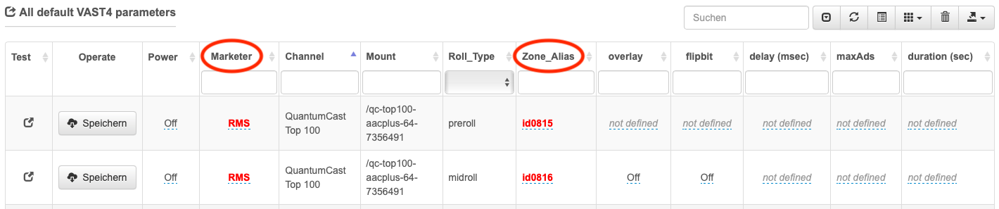

.. index:: Werbung

Werbekonfiguration mit dem QuantumCast-Playout
********************************************

Grundlegende Einstellungen
============================

Um Werbung in einen Stream einplanen zu können, ist es wichtig den Vermarkter und den Zonen-Alias anzugeben. Dafür in die QuantumCast Console einloggen und den entsprechenden Channel auswählen. Anschließend in den Bereich „Werbespots“ gehen.

.. image:: img/Playout_Werbung_Beginn.png 

Hier weiter nach unten scrollen. Unter „All default VAST4 parameters“ lassen sich alle grundlegenden Einstellungen treffen. Kunden, die ihr Playout über QuantumCast machen, müssen lediglich den „Marketer“ und die „Zone_Alias“ angeben. 

Diese Angaben müssen für Preroll- und Midroll-Spots gemacht werden – jeweils für alle Hörer-Mountpoints. Anschließend noch die Einstellung bei „Power“ auf „On“ setzen und jeweils „Speichern“ anklicken.

Sollte es Probleme mit den Spots geben, kann man sich die Spalte „Test“ anzeigen lassen. 

.. hint::

   Die Einstellungen für "overlay" und "flipbit" spielen beim QuantumCast-Playout keine Rolle, sondern müssen nur bei einer externen Audioquelle angegeben werden. Werden die Felder für "maxAds" und "duration" nicht ausgefüllt, werden folgende Systemstandards verwendet:

   - Preroll: maxAd = 1 Spot, duration = 48 Sekunden
   - Midroll: maxAd = 3 Spots, duration = 63 Sekunden 
   Diese Einstellungen werden allerdings überschrieben, wenn Sie für das QuantumCast-Playout einen Werbetrigger konfigurieren: :ref:`Konfiguration der Midroll-Spots <KonfigurationMidroll>` 
   
   Siehe dazu auch: :ref:`Priorisierung der Werbeeinstellung <Priorisierung>`

.. image:: img/Playout_Werbung_Test.png

Durch einen Klick auf das Symbol wird ein Spotanfrage beim Vermarkter angefordert. Es öffnet sich ein neues Browser-Fenster, in dem die Rückgabe-Daten der Spotanfrage angezeigt werden. 

Eröffnen Sie ein Ticket im Helpdesk und lassen Sie uns diese Rückgabe-Daten der Spotanfrage und den Channel-Key (zu finden im Setup) zukommen.

.. _KonfigurationMidroll: 

Konfiguration der Midroll-Spots
===================================

Wenn das Playout über die QuantumCast Console erstellt wurde, lässt sich Midroll- / Instream-Werbung sehr schnell und unkompliziert in den Stream einplanen. Dafür den entsprechenden Channel auswählen und anschließend in den Bereich „Werbespots“ gehen. Hier auf „+ Neuen Werbeblock hinzufügen“ klicken.

.. image:: img/Playout_Werbung_Start.png

Nun müssen die „Max. Länge“ und die „Längeneinheit“ eingestellt werden. Bei der „Längeneinheit“ kann man zwischen „Sekunden“ und „Spots“ wählen. Im Beispiel wäre der Werbeblock 60 Sekunden lang.

.. image:: img/Playout_Werbung_NeuerBlock.png

Am Ende jede Eingabe mit einem Klick auf den Haken bestätigen und „speichern & beauftragen“ klicken. 

Folgender Standard wird nach erfolgreichem Speichern angeboten – „Max. Länge“ und „Längeneinheit“ werden an Hand der vorherigen Einstellung übernommen.

.. image:: img/Playout_Werbung_Speichern.png

Diese Konfiguration kann nun weiter verfeinert werden.

Zunächst muss eingestellt werden, wie oft der Werbeblock laufen soll. Hierfür gibt es unter „Plan“ vier verschiedene Optionen: „Alle X Elemente“, „Nach dem X. Element der Stunde“, „Alle X Minuten“ und „Nach X Minuten der Stunde“. Anschließend noch den Wert für „X“ festlegen. Im folgenden Beispiel bedeutet das: alle 30 Minuten wird ein Werbeblock eingeplant.

.. image:: img/Playout_Werbung_plan.png

Da es nicht immer gewollt ist 24 Stunden lang an sieben Tagen die Woche Werbung zu schalten, lässt sich der Zeitraum begrenzen. Dafür die entsprechenden Wochentage anklicken.

.. image:: img/Playout_Werbung_Wochentage.png

Genauso lassen sich auch die Tageszeiten einschränken. Hier kann man vordefinierte Zeitbereiche nutzen, oder jede einzelne Stunde von 0:00 bis 24:00 Uhr separat anwählen.

.. image:: img/Playout_Werbung_Stunden.png

Bei Start und Ende kann noch der Aktivitätszeitraum des Werbeblocks festgelegt werden.

.. image:: img/Playout_Werbung_StartEnde_Vor.png

Soll die Werbung nur in einem bestimmten Zeitfenster ausgespielt werden, einfach auf „Immer“ bzw. „Nie“ klicken – dann öffnet sich ein Feld, in dem man Datum und Uhrzeit angeben kann.

.. image:: img/Playout_Werbung_Start_einstellen.png

Zum Schluss denn Werbeblock noch aktivieren. Dafür bei „Power“ die Einstellung auf „On“ setzen.

.. image:: img/Playout_Werbung_fertigeEinstellung.png

Nun ist der Werbeblock aktiv und entsprechend seiner Einstellungen in den Channel eingeplant.

.. image:: img/Playout_Werbung_Status_Power.png

Es ist auch möglich mehrere Werbeblöcke mit unterschiedlichen Parametern für den Channel zu definieren. Hier einige Anwendungsbeispiele:

* Unterschiedliche Länge der Werbeblöcke zur halben und vollen Stunde

* Verschiedene Planungen für Werktage und Wochenenden

* Werbung soll zwischen 9.00 und 18.00 Uhr häufiger laufen, als nach Feierabend

Sollte später einer der Werbeblock nicht mehr benötigt werden, lässt er sich einfach löschen indem man bei „Operate“ auf das Mülltonnen-Symbol klickt.

.. image:: img/Playout_Werbung_Loeschen.png

Alle Werbeeinstellungen lassen sich im Nachhinein jederzeit wieder verändern. Dafür bei „Channelservices“ auf „Bearbeiten“ klicken und den entsprechenden Channel auswählen.

.. seealso:: `Einen bestehenden Channel bearbeiten <http://doku.streamabc.com/de/latest/console/channelservices.html#den-channel-bearbeiten-oder-loschen>`_ 

----

Bei weiteren Fragen bitte ein Ticket öffnen: |helpdesk|

Besuchen Sie unsere Unternehmens-Website |www.quantumcast-digital.de|

.. |helpdesk| raw:: html

    <a href="https://streamabc.zammad.com" target="_blank">https://streamabc.zammad.com</a>

.. |www.quantumcast-digital.de| raw:: html

   <a href="https://www.quantumcast-digital.de" target="_blank">www.quantumcast-digital.de</a>

.. |Console| raw:: html

   <a href="https://www.quantumcast-digital.de" target="_blank">Console</a>
   
